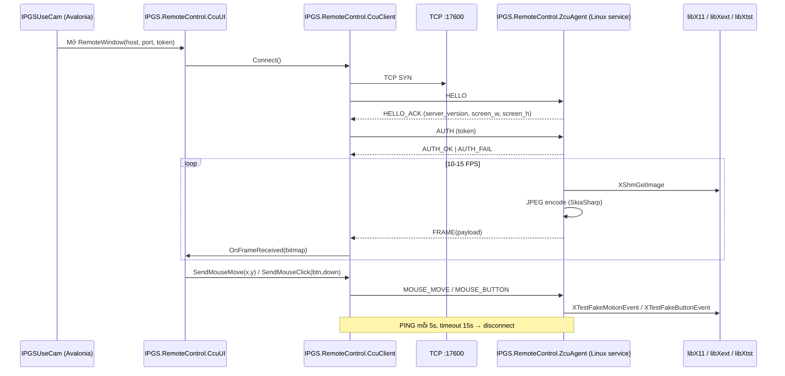

# TDD — CCU ↔ ZCU Remote Control (Remote Desktop tự xây)

## 1. Bối cảnh

- **CCU:** Windows, Avalonia (IPGSUseCam) — đóng vai **client** điều khiển.
- **ZCU:** Ubuntu 22.04, session **X11** (`XDG_SESSION_TYPE=x11`), .NET 8 — đóng vai **server**.
- **Mục tiêu:** Từ CCU xem màn hình ZCU và điều khiển chuột như remote desktop, KHÔNG dùng VNC/RDP/TeamViewer (tránh license).
- **Ràng buộc cứng:** Chỉ tạo 3 project mới; **không sửa** `IPGS.Object`, `IPGSUseCam`, `IPGS.LPR_SERVER`, ... Ngoại lệ duy nhất: `IPGSUseCam` được thêm `<ProjectReference>` sang `IPGS.RemoteControl.CcuUI` + 1 entry point (menu/nút) mở window remote.

## 2. Goals / Non-goals

**Goals (v1):**
- Stream màn hình ZCU (primary display) → CCU với FPS 10-15, JPEG q=70.
- CCU gửi mouse move + click (Left/Right/Middle) về ZCU, ZCU inject qua XTest.
- Authentication đơn giản: shared secret + whitelist IP (config 2 phía).
- Reconnect tự động (client-side) khi mất kết nối.

**Non-goals (v1) — để ngỏ v2:**
- Bàn phím (keyboard injection qua XTestFakeKeyEvent).
- Nhiều màn hình / chọn màn hình.
- H.264 encoding (chỉ JPEG v1).
- TLS/mTLS (chỉ shared-secret plaintext v1 — chạy trong LAN nội bộ).
- Clipboard, drag-drop, file transfer.
- Multi-client (chỉ 1 CCU kết nối tại 1 thời điểm).

## 3. Kiến trúc tổng quan (mermaid)



## 4. Cấu trúc solution & project mới

3 project mới, đặt **ngang hàng** với các project hiện có ở root repo:

```
iPGSv4/
├── IPGS.RemoteControl.ZcuAgent/     ← .NET 8, Linux service (executable)
│   ├── IPGS.RemoteControl.ZcuAgent.csproj  (TargetFramework=net8.0, RuntimeIdentifier=linux-x64)
│   ├── Program.cs
│   ├── Interop/X11Interop.cs        ← P/Invoke libX11
│   ├── Interop/XShmInterop.cs       ← P/Invoke libXext (XShm)
│   ├── Interop/XTestInterop.cs      ← P/Invoke libXtst
│   ├── Capture/X11ScreenCapturer.cs
│   ├── Capture/JpegEncoder.cs       ← SkiaSharp
│   ├── Input/MouseInjector.cs
│   ├── Net/TcpServer.cs
│   ├── Net/ClientSession.cs
│   ├── Protocol/*                    ← shared với CcuClient qua source-link hoặc copy
│   └── appsettings.json              ← port, token, whitelist, fps, quality
│
├── IPGS.RemoteControl.CcuClient/    ← .NET 8, cross-platform library
│   ├── IPGS.RemoteControl.CcuClient.csproj (TargetFramework=net8.0)
│   ├── RemoteControlClient.cs        ← IRemoteControlClient
│   ├── FrameDecoder.cs               ← SkiaSharp decode JPEG
│   ├── Protocol/MessageCodec.cs
│   ├── Protocol/MessageTypes.cs
│   └── Events: FrameReceived, ConnectionStateChanged
│
├── IPGS.RemoteControl.CcuUI/        ← .NET 8, Avalonia UserControl+Window
│   ├── IPGS.RemoteControl.CcuUI.csproj (references CcuClient + Avalonia)
│   ├── Views/RemoteScreenWindow.axaml(.cs)
│   ├── Views/RemoteScreenControl.axaml(.cs)   ← Image bind bitmap + PointerPressed/Moved
│   └── ViewModels/RemoteScreenViewModel.cs
│
└── IPGSUseCam/  (HIỆN CÓ — chỉ thêm 1 ProjectReference + 1 menu item)
    └── (menu "Remote ZCU" → new RemoteScreenWindow(...).Show())
```

**Namespace pattern:** `IPGS.RemoteControl.{ZcuAgent|CcuClient|CcuUI}.*`
**Protocol code:** đặt trong `IPGS.RemoteControl.CcuClient/Protocol/` và **link** (`<Compile Include="..\IPGS.RemoteControl.CcuClient\Protocol\**\*.cs" Link="Protocol\%(RecursiveDir)%(Filename)%(Extension)"/>`) sang ZcuAgent để dùng chung message format — tránh copy-paste.
**Solution:** thêm 3 project vào `iPGSv4.sln` (nếu tồn tại) hoặc `IPGSUseCam.sln`. Tech Lead khuyến nghị: dùng chung solution hiện có để Debug/F5 tiện lợi.

## 5. Giao thức TCP — Message Format

### 5.1 Framing (length-prefix, binary, big-endian)

Mỗi message trên wire:

```
Offset  Size   Field           Ghi chú
------  -----  --------------  --------------------------------------
0       1      MessageType     enum byte (bảng 5.2)
1       4      PayloadLength   uint32 big-endian, độ dài PAYLOAD (không tính header 5 byte)
5       N      Payload         binary, format tuỳ MessageType
```

- **Max payload:** 8 MB (`MAX_FRAME_BYTES = 8 * 1024 * 1024`). Server/client PHẢI reject và đóng kết nối nếu `PayloadLength > MAX_FRAME_BYTES`.
- Endianness: big-endian cho tất cả trường số nhiều byte (network order).
- Không có magic number ở đầu mỗi message — vì đã có handshake HELLO ngay sau khi TCP mở (xem §7). Nếu HELLO sai → đóng.

### 5.2 Bảng MessageType

| ID (byte) | Tên | Chiều | Payload | Mô tả |
|-----------|-----|-------|---------|-------|
| 0x01 | HELLO | C→S | `u8 protocolVersion=1` + `u16 clientNameLen` + `utf8 clientName` | Bắt tay đầu tiên |
| 0x02 | HELLO_ACK | S→C | `u8 protocolVersion` + `u32 screenWidth` + `u32 screenHeight` + `u16 serverNameLen` + `utf8 serverName` | Server chấp nhận version |
| 0x03 | AUTH | C→S | `u16 tokenLen` + `utf8 token` | Shared secret |
| 0x04 | AUTH_OK | S→C | (empty) | Auth thành công |
| 0x05 | AUTH_FAIL | S→C | `u16 reasonLen` + `utf8 reason` | Auth thất bại → server đóng ngay |
| 0x10 | FRAME_JPEG | S→C | `u64 frameId` + `u32 timestampMs` + `u32 width` + `u32 height` + `u32 jpegLen` + `bytes jpegData` | Frame màn hình |
| 0x20 | MOUSE_MOVE | C→S | `i32 x` + `i32 y` (toạ độ ZCU screen space) | Di chuột |
| 0x21 | MOUSE_BUTTON | C→S | `u8 button` (1=Left, 2=Middle, 3=Right, 4=WheelUp, 5=WheelDown) + `u8 down` (1=press, 0=release) + `i32 x` + `i32 y` | Nhấn/nhả nút |
| 0x30 | PING | Cả 2 chiều | `u64 nonce` | Keepalive |
| 0x31 | PONG | Cả 2 chiều | `u64 nonce` (echo) | Trả lời PING |
| 0x7F | BYE | Cả 2 chiều | (empty) | Đóng chủ động |

**Reserved ranges (v2):** `0x40-0x4F` keyboard, `0x50-0x5F` clipboard, `0x60-0x6F` H.264/video.

### 5.3 Toạ độ chuột

- CCU gửi toạ độ đã map **về không gian screen của ZCU** (0..screenWidth-1, 0..screenHeight-1). Việc scale từ pixel Avalonia (control size) → ZCU screen do `RemoteScreenControl` xử lý trước khi gọi `CcuClient.SendMouseMove/SendMouseButton`.
- ZCU nhận toạ độ ngoài range → clamp về biên, không disconnect.

## 6. Frame Pipeline

### 6.1 ZCU-side capture loop (pseudocode)

```csharp
// Chu kỳ: 1000 / TARGET_FPS ms (mặc định 15fps → 66ms)
while (running) {
    var sw = Stopwatch.StartNew();
    XShmGetImage(display, rootWindow, shmImage, 0, 0, AllPlanes);   // capture vào shared memory buffer
    var skBitmap = WrapAsSKBitmap(shmImage);                        // zero-copy nếu có thể
    using var jpeg = skBitmap.Encode(SKEncodedImageFormat.Jpeg, JPEG_QUALITY);  // 70
    if (jpeg.Size > MAX_FRAME_BYTES) { LogWarn(); continue; }
    session.SendFrame(frameId++, DateTime.UtcNow, width, height, jpeg.AsSpan());
    var remaining = FRAME_INTERVAL_MS - (int)sw.ElapsedMilliseconds;
    if (remaining > 0) Thread.Sleep(remaining);
}
```

### 6.2 CCU-side decode/render

```
CcuClient.OnMessage(FRAME_JPEG)
  → decode JPEG bằng SkiaSharp SKBitmap.Decode
  → wrap thành Avalonia Bitmap (SKBitmap → WriteableBitmap qua PixelData copy, hoặc dùng SkiaSharp Avalonia interop)
  → raise FrameReceived event trên UI thread (Dispatcher.UIThread.Post)
  → RemoteScreenViewModel.CurrentFrame = bitmap
  → <Image Source={Binding CurrentFrame}/> render
```

**Tối ưu:** Dùng **2 SKBitmap luân phiên (double-buffer)** để không cấp phát lại mỗi frame. Cấp phát lại chỉ khi resolution ZCU thay đổi.

### 6.3 Thư viện cross-platform (chọn dứt điểm)

- **JPEG encode/decode:** `SkiaSharp` (`SkiaSharp` NuGet + `SkiaSharp.NativeAssets.Linux` cho ZcuAgent). Lý do: chạy tốt trên .NET 8 Linux, không phụ thuộc System.Drawing (đã deprecated cross-platform).
- **Ảnh raw từ X11:** truy cập `XImage.data` (pointer) qua `Marshal.Copy` hoặc `Span<byte>` → tạo `SKBitmap` với `SKColorType.Bgra8888` (X11 mặc định trên hầu hết display 24/32-bit).
- **KHÔNG dùng:** `System.Drawing.Common` (Windows-only từ .NET 6+), `ImageSharp` (chậm hơn SkiaSharp cho JPEG streaming).

## 7. Connection Lifecycle (state machine)

```
[Disconnected] --Connect()--> [Connecting]
[Connecting] --TCP OK, send HELLO--> [WaitHelloAck]
[WaitHelloAck] --HELLO_ACK--> [WaitAuth]  (client gửi AUTH ngay)
[WaitHelloAck] --timeout 5s / bad msg--> [Disconnected]
[WaitAuth] --AUTH_OK--> [Streaming]
[WaitAuth] --AUTH_FAIL / timeout 5s--> [Disconnected] (không retry ngay nếu AUTH_FAIL)
[Streaming] --FRAME/PING/PONG--> [Streaming]
[Streaming] --PING timeout (không PONG trong 15s) / BYE / socket error--> [Disconnected]
[Disconnected] --auto reconnect delay 3s (trừ AUTH_FAIL)--> [Connecting]
```

- Reconnect delay: 3s (jitter ±1s) — tối đa 10 lần liên tiếp trước khi dừng và yêu cầu user click "Kết nối lại".
- AUTH_FAIL → KHÔNG tự reconnect (tránh brute force). User phải sửa token/config rồi thử lại.

## 8. Authentication (v1)

### 8.1 Shared secret

- Cả ZCU (`appsettings.json`) và CCU (Avalonia settings) cấu hình 1 chuỗi `Token` (khuyến nghị ≥ 32 ký tự random).
- CCU gửi AUTH (0x03) plaintext (v1). ZCU so sánh bằng **constant-time compare** (`CryptographicOperations.FixedTimeEquals` trên byte[] UTF-8) để tránh timing attack.
- **Lưu ý bảo mật v1:** plaintext trên LAN — chấp nhận rủi ro sniff nội bộ. **v2** upgrade sang challenge-response HMAC-SHA256 + TLS.

### 8.2 IP whitelist

- ZCU cấu hình `AllowedClientIPs: ["192.168.1.10", "192.168.1.0/24"]`. TCP accept → check `RemoteEndPoint.Address` trước khi đọc HELLO. Không match → đóng socket ngay, log warn.

### 8.3 Rate limit

- Sau 3 AUTH_FAIL trong 60s từ 1 IP → ban IP 5 phút. Đơn giản, in-memory dict, đủ cho v1.

## 9. P/Invoke Signatures (Linux X11)

### 9.1 libX11 (`libX11.so.6`)

```csharp
[DllImport("libX11.so.6")] static extern IntPtr XOpenDisplay(string? displayName);
[DllImport("libX11.so.6")] static extern int XCloseDisplay(IntPtr display);
[DllImport("libX11.so.6")] static extern IntPtr XDefaultRootWindow(IntPtr display);
[DllImport("libX11.so.6")] static extern int XDefaultScreen(IntPtr display);
[DllImport("libX11.so.6")] static extern int XDisplayWidth(IntPtr display, int screen);
[DllImport("libX11.so.6")] static extern int XDisplayHeight(IntPtr display, int screen);
[DllImport("libX11.so.6")] static extern IntPtr XGetImage(IntPtr display, IntPtr window, int x, int y,
    uint width, uint height, ulong planeMask, int format);   // format: ZPixmap=2
[DllImport("libX11.so.6")] static extern int XDestroyImage(IntPtr ximage);
[DllImport("libX11.so.6")] static extern int XSync(IntPtr display, bool discard);
[DllImport("libX11.so.6")] static extern int XFlush(IntPtr display);
[DllImport("libX11.so.6")] static extern IntPtr XInitThreads();
```

### 9.2 libXext — MIT-SHM (`libXext.so.6`)

```csharp
[StructLayout(LayoutKind.Sequential)]
struct XShmSegmentInfo {
    public int shmseg;      // ShmSeg (XID)
    public int shmid;       // System V shmid
    public IntPtr shmaddr;  // pointer to attached shared memory
    public int readOnly;    // Bool
}

[DllImport("libXext.so.6")] static extern bool XShmQueryExtension(IntPtr display);
[DllImport("libXext.so.6")] static extern IntPtr XShmCreateImage(IntPtr display, IntPtr visual,
    uint depth, int format, IntPtr data, ref XShmSegmentInfo shmInfo, uint width, uint height);
[DllImport("libXext.so.6")] static extern bool XShmAttach(IntPtr display, ref XShmSegmentInfo shmInfo);
[DllImport("libXext.so.6")] static extern bool XShmDetach(IntPtr display, ref XShmSegmentInfo shmInfo);
[DllImport("libXext.so.6")] static extern bool XShmGetImage(IntPtr display, IntPtr drawable, IntPtr ximage,
    int x, int y, ulong planeMask);
```

SysV shm (libc): `shmget`, `shmat`, `shmdt`, `shmctl`:

```csharp
[DllImport("libc")] static extern int shmget(int key, UIntPtr size, int shmflg);   // IPC_PRIVATE=0, 0600|IPC_CREAT=0x400|0x180
[DllImport("libc")] static extern IntPtr shmat(int shmid, IntPtr shmaddr, int shmflg);
[DllImport("libc")] static extern int shmdt(IntPtr shmaddr);
[DllImport("libc")] static extern int shmctl(int shmid, int cmd, IntPtr buf);      // IPC_RMID=0
```

### 9.3 libXtst — XTest (`libXtst.so.6`)

```csharp
[DllImport("libXtst.so.6")] static extern int XTestFakeMotionEvent(IntPtr display, int screen, int x, int y, ulong delay);
[DllImport("libXtst.so.6")] static extern int XTestFakeButtonEvent(IntPtr display, uint button, bool isPress, ulong delay);
[DllImport("libXtst.so.6")] static extern int XTestFakeKeyEvent(IntPtr display, uint keycode, bool isPress, ulong delay);  // reserved v2
```

**Gotcha đã ghi nhận (đưa vào `.claude/GOTCHAS.md` sau khi impl):**
- `XInitThreads()` PHẢI gọi **trước** `XOpenDisplay` nếu muốn dùng X11 từ nhiều thread (capture thread + inject thread).
- `XShmGetImage` trả về `Bool` (int 0/1), KHÔNG throw — phải check return.
- Chỉ hoạt động trên **X11**, KHÔNG chạy trên Wayland. Kiểm tra `$XDG_SESSION_TYPE` khi start service, refuse nếu không phải `x11`.
- `XTestFakeButtonEvent` cần `XFlush(display)` sau đó để event thực sự được gửi.

## 10. Interface C# công khai

### 10.1 IPGS.RemoteControl.CcuClient

```csharp
public interface IRemoteControlClient : IDisposable {
    ConnectionState State { get; }
    event EventHandler<FrameReceivedEventArgs>? FrameReceived;
    event EventHandler<ConnectionStateChangedEventArgs>? StateChanged;

    Task ConnectAsync(string host, int port, string token, CancellationToken ct = default);
    Task DisconnectAsync();
    Task SendMouseMoveAsync(int x, int y);
    Task SendMouseButtonAsync(MouseButton button, bool isDown, int x, int y);
}

public enum ConnectionState { Disconnected, Connecting, Authenticating, Streaming, Faulted }
public enum MouseButton : byte { Left=1, Middle=2, Right=3, WheelUp=4, WheelDown=5 }

public sealed class FrameReceivedEventArgs : EventArgs {
    public long FrameId { get; init; }
    public int Width { get; init; }
    public int Height { get; init; }
    public ReadOnlyMemory<byte> JpegData { get; init; }   // caller chịu trách nhiệm decode
    public DateTime CapturedUtc { get; init; }
}
```

### 10.2 IPGS.RemoteControl.ZcuAgent (nội bộ)

```csharp
internal interface IScreenCapturer { Task<CapturedFrame> CaptureAsync(CancellationToken ct); Size ScreenSize { get; } }
internal interface IFrameEncoder    { byte[] EncodeJpeg(CapturedFrame frame, int quality); }
internal interface IMouseInjector   { void Move(int x, int y); void Button(MouseButton b, bool down); }
internal interface ITcpServer       { Task RunAsync(CancellationToken ct); }
```

Program.cs = Generic Host (`Microsoft.Extensions.Hosting`) → `AddHostedService<RemoteControlHostedService>()`. Chạy qua `systemd` unit trên ZCU (file unit sẽ do bước 2.1 tạo).

### 10.3 IPGS.RemoteControl.CcuUI

```csharp
public partial class RemoteScreenWindow : Window {
    public RemoteScreenWindow(string host, int port, string token) { ... }
}
public partial class RemoteScreenControl : UserControl { ... }   // dùng KztekComponentAvalonia nơi có thể
```

## 11. Constants (dùng chung)

| Hằng số | Giá trị mặc định | Ghi chú |
|---------|-------------------|---------|
| `DEFAULT_PORT` | `17600` | TCP port, cấu hình được |
| `PROTOCOL_VERSION` | `1` | tăng khi breaking |
| `MAX_FRAME_BYTES` | `8 * 1024 * 1024` (8 MB) | reject nếu vượt |
| `TARGET_FPS` | `15` | cấu hình 5-30 |
| `JPEG_QUALITY` | `70` | cấu hình 40-95 |
| `PING_INTERVAL_MS` | `5000` | client + server đều gửi |
| `PING_TIMEOUT_MS` | `15000` | không nhận PONG → disconnect |
| `HANDSHAKE_TIMEOUT_MS` | `5000` | HELLO/AUTH mỗi phase |
| `RECONNECT_DELAY_MS` | `3000` | client-side, ±1s jitter |
| `MAX_RECONNECT_ATTEMPTS` | `10` | rồi dừng |

## 12. appsettings.json (ZcuAgent)

```json
{
  "RemoteControl": {
    "Port": 17600,
    "Token": "REPLACE_WITH_LONG_RANDOM_STRING",
    "AllowedClientIPs": [ "192.168.1.0/24" ],
    "TargetFps": 15,
    "JpegQuality": 70,
    "MaxFrameBytes": 8388608
  }
}
```

## 13. Security — v1 vs v2

| Aspect | v1 (sprint này) | v2 (roadmap) |
|--------|-----------------|--------------|
| Auth | shared secret plaintext + IP whitelist | HMAC-SHA256 challenge-response |
| Transport | TCP plaintext | TLS 1.3 (self-signed cert + pin) hoặc mTLS |
| Rate limit | 3 fail/60s → ban 5min | tăng + persistent log |
| Encoding | JPEG q=70 | H.264 (libx264/ffmpeg) — cần đánh giá CPU ZCU |
| Multi-monitor | 1 primary | chọn màn hình từ CCU |
| Keyboard | không có | XTestFakeKeyEvent |

## 14. Rủi ro & mitigation

| Rủi ro | Xác suất | Impact | Mitigation |
|--------|----------|--------|------------|
| Wayland thay X11 khi upgrade Ubuntu | Thấp v1 | Cao | Check `$XDG_SESSION_TYPE` khi start, refuse nếu `wayland` với message rõ ràng |
| `libXtst`/`libXext` không có sẵn | Thấp | Cao | Bước 2.1 doc rõ `apt install libxtst6 libxext6 libx11-6` trong deploy-linux/postinst |
| CPU cao khi FPS=15 + JPEG q=90 | Trung | Trung | Cấu hình mặc định q=70, fps=15; expose tuning |
| Chuột "nhảy" do delay + accumulator | Trung | Thấp | CCU throttle mouse-move ≤ 60Hz, chỉ gửi khi delta ≥ 2px |
| Frame > 8MB (màn hình 4K, texture nhiều) | Thấp | Trung | Giảm quality động khi vượt threshold (v1.1) |
| Token leak trong log | Trung | Cao | KHÔNG log token, kể cả debug. Log "AUTH_OK for <ip>" thôi |
| Kết nối treo (half-open TCP) | Trung | Trung | PING/PONG 5s + timeout 15s + `TcpKeepAlive` socket option |

## 15. Task breakdown (khớp PLAN-MASTER)

| ID | Tên | Owner | Estimate | Phụ thuộc |
|----|-----|-------|----------|-----------|
| 2.1 | Impl ZcuAgent (X11 capture + XTest + TCP server + auth) | Senior Dev | 3d | 1.1 |
| 2.2 | Review ZcuAgent | Tech Lead | 0.5d | 2.1 |
| 3.1 | Impl CcuClient (TCP client + decode + protocol) | Senior Dev | 2d | 1.1 |
| 3.2 | Impl CcuUI (Avalonia window + control + VM) | Senior Dev | 2d | 3.1 |
| 3.3 | Integrate vào IPGSUseCam (menu + reference only) | Senior Dev | 0.5d | 3.2 |
| 3.4 | Review CCU stack | Tech Lead | 0.5d | 3.3 |
| 4.1 | UX/UI review | UX/UI Reviewer | 0.5d | 3.4 |
| 4.2 | QA verify | QA Engineer | 1d | 4.1 |

**Total estimate:** ~10 dev-days.

## 16. Điểm mở rộng (không impl v1)

- **TLS:** wrap `NetworkStream` bằng `SslStream` — thêm 1 state `TlsHandshake` giữa TCP-connect và HELLO.
- **H.264:** thêm MessageType `0x60 FRAME_H264` + reserved payload `codec/profile/keyframe-flag`. Chọn thư viện: `FFmpeg.AutoGen` hoặc gọi `ffmpeg` process.
- **Keyboard:** MessageType `0x40 KEY_EVENT` (u32 keysym + u8 down). Map từ Avalonia `KeyEventArgs` → X11 keysym qua bảng.
- **Adaptive quality:** giảm JPEG quality khi round-trip PING > 100ms.

---

## 17. Keyboard Support (v1.1)

### 17.1 Phạm vi & quyết định thiết kế

**Goals v1.1:**
- Gõ phím từ CCU (Avalonia) → inject phím tương ứng trên ZCU (X11) qua XTest.
- Hỗ trợ đầy đủ: chữ cái A–Z (có Shift), số 0–9, ký tự ASCII in được (`!@#$%^&*()...`), phím điều khiển (Enter, Backspace, Tab, Escape, Delete, Arrow, Home/End, Page Up/Down, Insert, F1–F12), phím modifier độc lập (Shift, Ctrl, Alt, Super/Windows, CapsLock, NumLock).
- Tổ hợp phím (Ctrl+C, Alt+Tab, Ctrl+Shift+T, ...) bằng cách CCU gửi các press/release riêng cho MỖI phím theo đúng thứ tự vật lý — KHÔNG có "modifier flags" trong 1 message.

**Non-goals v1.1:**
- Ký tự Unicode ngoài Latin-1 (tiếng Việt có dấu, CJK, Emoji, ...) — xem §17.6 rủi ro.
- Dead keys / compose sequence (`^` + `a` → `â`) — X11 tự xử lý nếu keymap ZCU có, nhưng CCU không chủ động phát dead-key.
- IME state sync (CapsLock/NumLock LED giữa 2 máy).
- Key repeat rate custom — dùng auto-repeat mặc định của X11 (client gửi 1 press, X server tự lặp khi phím giữ; hoặc CCU forward event repeat của Avalonia — chọn phương án A: chỉ gửi press+release, để X11 tự lặp qua `XkbSetAutoRepeatRate` mặc định).

### 17.2 Message format — KEY_EVENT (0x40)

Bảng §5.2 bổ sung dòng mới:

| ID | Tên | Chiều | Payload | Mô tả |
|----|-----|-------|---------|-------|
| 0x40 | KEY_EVENT | C→S | `u32 keysym` + `u8 down` (1=press, 0=release) | Nhấn/nhả 1 phím theo X11 keysym |

- Payload cố định 5 byte, big-endian.
- KHÔNG có field modifier flags — modifier gửi như phím độc lập (xem §17.1).
- ZCU nhận keysym không map được keycode (`XKeysymToKeycode` trả 0) → log warning + drop, KHÔNG disconnect.

**Reserved (v2 khả năng dùng thêm):** `0x41 KEY_UNICODE_STRING` để paste chuỗi Unicode tuỳ ý bằng cách gọi `xdotool type`-like logic (map từng char thành tạm-remap keycode). Không impl trong v1.1.

### 17.3 Ánh xạ Avalonia → X11 keysym (phía CCU)

Hai nguồn thông tin từ `Avalonia.Input.KeyEventArgs`:
1. `e.Key` (enum `Avalonia.Input.Key`) — phím vật lý/logic (A, Enter, F5, ...).
2. `e.KeySymbol` (string?, thêm từ Avalonia 11) — ký tự Unicode đã áp Shift/AltGr, ví dụ khi nhấn Shift+2 US layout thì `KeySymbol = "@"`.

**Thuật toán map (theo thứ tự ưu tiên):**

```
1. Nếu e.Key thuộc bảng SPECIAL_KEY_MAP (Enter, Backspace, F1..F12, Arrow, Modifier, ...):
   → return SPECIAL_KEY_MAP[e.Key]              // keysym cố định

2. Nếu e.KeySymbol có đúng 1 ký tự Unicode `ch`:
   a. Nếu ch ≤ 0x00FF (ASCII + Latin-1):
      → return (uint)ch                          // keysym trùng codepoint (chuẩn X11 §Appendix A)
   b. Nếu ch > 0x00FF:
      → return 0x01000000u | (uint)ch            // X11 Unicode keysym (chuẩn XKB)
      → LƯU Ý: nhiều keymap không có key vật lý cho keysym Unicode → ZCU sẽ log warn (xem §17.6)

3. Fallback theo e.Key nếu KeySymbol null (VD: giữ Ctrl không có KeySymbol):
   → tra bảng LETTER_KEY_MAP (Key.A → 0x0061 'a', v.v.)
   → nếu không có → return 0 (drop, không gửi)
```

**Bảng SPECIAL_KEY_MAP (bắt buộc, tối thiểu 40 mục — trích chuẩn `<X11/keysymdef.h>`):**

| Avalonia `Key` | Keysym (hex) | Ký hiệu chuẩn |
|---|---|---|
| Return / Enter | `0xFF0D` | XK_Return |
| Back (Backspace) | `0xFF08` | XK_BackSpace |
| Tab | `0xFF09` | XK_Tab |
| Escape | `0xFF1B` | XK_Escape |
| Space | `0x0020` | XK_space |
| Delete | `0xFFFF` | XK_Delete |
| Insert | `0xFF63` | XK_Insert |
| Home | `0xFF50` | XK_Home |
| End | `0xFF57` | XK_End |
| PageUp | `0xFF55` | XK_Prior |
| PageDown | `0xFF56` | XK_Next |
| Left | `0xFF51` | XK_Left |
| Up | `0xFF52` | XK_Up |
| Right | `0xFF53` | XK_Right |
| Down | `0xFF54` | XK_Down |
| F1..F12 | `0xFFBE`..`0xFFC9` | XK_F1..XK_F12 |
| LeftShift | `0xFFE1` | XK_Shift_L |
| RightShift | `0xFFE2` | XK_Shift_R |
| LeftCtrl | `0xFFE3` | XK_Control_L |
| RightCtrl | `0xFFE4` | XK_Control_R |
| LeftAlt | `0xFFE9` | XK_Alt_L |
| RightAlt | `0xFFEA` | XK_Alt_R |
| LWin / LeftMeta | `0xFFEB` | XK_Super_L |
| RWin / RightMeta | `0xFFEC` | XK_Super_R |
| CapsLock | `0xFFE5` | XK_Caps_Lock |
| NumLock | `0xFF7F` | XK_Num_Lock |
| Scroll | `0xFF14` | XK_Scroll_Lock |
| PrintScreen | `0xFF61` | XK_Print |
| Pause | `0xFF13` | XK_Pause |
| Menu / Apps | `0xFF67` | XK_Menu |

> Nguồn chính thức: `/usr/include/X11/keysymdef.h` — Senior Dev PHẢI dán constants từ file này, KHÔNG tự đoán.

### 17.4 Phía ZCU — KeyboardInjector

Pattern **giống hệt** `MouseInjector` (§10.2, code hiện có). File mới `Input/KeyboardInjector.cs`:

```csharp
internal interface IKeyboardInjector : IDisposable
{
    void Initialize();
    void SendKey(uint keysym, bool isDown);
}

internal sealed class KeyboardInjector : IKeyboardInjector
{
    // XOpenDisplay riêng (giống MouseInjector, tránh contention với capturer)
    public void SendKey(uint keysym, bool isDown)
    {
        if (!_initialized || _disposed) return;
        byte keycode = X11.XKeysymToKeycode(_display, keysym);   // ← P/Invoke MỚI
        if (keycode == 0)
        {
            _logger.LogWarning("KeyboardInjector: keysym 0x{Keysym:X} không map được keycode trên keymap hiện tại — bỏ qua", keysym);
            return;
        }
        XTest.XTestFakeKeyEvent(_display, keycode, isDown, 0);
        X11.XFlush(_display);
        X11.XSync(_display, false);   // surface async X errors ngay (theo pattern MouseInjector)
    }
}
```

### 17.5 P/Invoke bổ sung (libX11)

Thêm vào `Interop/X11Interop.cs`:

```csharp
/// <summary>
/// Trả về keycode (byte, 8..255) tương ứng keysym trên keymap hiện tại,
/// hoặc 0 nếu không tồn tại. Không throw. Man: XKeysymToKeycode(3).
/// </summary>
[DllImport("libX11.so.6")]
public static extern byte XKeysymToKeycode(IntPtr display, uint keysym);
```

`XTestFakeKeyEvent` đã reserved sẵn trong `XTestInterop.cs` — chỉ cần đổi doc-comment từ "Reserved for v2" sang "Used for v1.1 keyboard injection".

### 17.6 Interface C# công khai bổ sung

**IPGS.RemoteControl.CcuClient — `IRemoteControlClient` thêm:**

```csharp
Task SendKeyEventAsync(uint keysym, bool isDown);
```

**MessageCodec bổ sung:**

```csharp
public static byte[] EncodeKeyEvent(uint keysym, bool isDown) { /* 5 byte, u32 BE + u8 */ }
public static (uint Keysym, bool IsDown) DecodeKeyEvent(byte[] payload) { ... }
```

**CcuUI — `RemoteScreenControl`:**
- Đặt `Focusable="True"` trên control gốc.
- Handle `KeyDown` + `KeyUp` (XAML `KeyDown`/`KeyUp` event, hoặc override `OnKeyDown/OnKeyUp`).
- Gọi `RemoteScreenViewModel.HandleKey(Key key, string? keySymbol, bool isDown)` — VM chứa mapper thuần (dễ unit-test).
- **Preview events:** `AddHandler(InputElement.KeyDownEvent, ..., RoutingStrategies.Tunnel)` để bắt Tab/Alt+F4/... trước khi Avalonia xử lý focus-cycling — nếu không, Tab sẽ nhảy focus nội bộ mà không gửi đi.
- Khi mất focus (LostFocus) → gửi release cho MỌI phím đang giữ (tracking `HashSet<uint>` các keysym down) để tránh "phím kẹt" trên ZCU. Áp dụng cả khi disconnect.

### 17.7 Gotcha — bổ sung vào `.claude/GOTCHAS.md` sau khi impl

- `XKeysymToKeycode` trả `byte` (KeyCode = unsigned char trong X11), 0 nghĩa là **không có key vật lý** trên keymap hiện tại — KHÔNG có nghĩa là lỗi.
- `XTestFakeKeyEvent` cần `XFlush` sau đó, giống `XTestFakeButtonEvent`. Bỏ qua sẽ khiến phím "bị nuốt" lặng lẽ.
- Modifier phải gửi press TRƯỚC key chính và release SAU: `Shift_L↓ + A↓ + A↑ + Shift_L↑` để có 'A' hoa. CCU code-behind phải theo dõi trạng thái Shift/Ctrl/Alt Avalonia và gửi các event modifier tương ứng khi thay đổi — ĐỪNG dựa vào X server tự infer từ keysym 'A' (nó chỉ inject 1 keycode raw, không có shift-state).
- Avalonia `Tab` mặc định bị "nuốt" bởi focus-navigation → dùng `Tunnel` handler.
- `Alt+F4`, `Ctrl+W` trên Windows sẽ được OS/Avalonia xử lý TRƯỚC → CCU nên có nút "Send Ctrl+Alt+Del" và các tổ hợp đặc biệt qua UI button riêng (v1.2).

### 17.8 Rủi ro & hạn chế v1.1

| Rủi ro | Mitigation v1.1 |
|--------|-----------------|
| **Tiếng Việt có dấu (ă, ơ, ệ, ...) không gõ được trực tiếp** — X11 Unicode keysym `0x01000000+cp` cần key vật lý map trong keymap, hầu như không có với keymap US/VN chuẩn. IME (ibus/fcitx) hoạt động ở tầng application/input-method, KHÔNG ở tầng XTest raw injection | **Giải pháp thực tế:** bật IME trên ZCU (ibus-unikey / ibus-bamboo), CCU chỉ cần gửi các ký tự ASCII gốc (`aw` → `ă`, `oo` → `ô` theo TELEX). Người dùng gõ TELEX/VNI trực tiếp — IME ZCU compose. Ghi rõ trong user manual. Alternative v2: KEY_UNICODE_STRING (§17.2). |
| Một số phím media/browser trên Windows không có keysym tương đương | Skip nếu không map được — không gửi |
| Focus bị "nuốt" bởi menu/popup Avalonia | Test kỹ trong QA — có thể cần capture ở window-level thay control-level |
| Auto-repeat kép (CCU repeat + X server repeat) | CCU CHỈ gửi press khi Avalonia raise KeyDown lần đầu, KHÔNG forward event repeat của Avalonia (check `e.RoutingStrategies` hoặc dedupe qua HashSet keysym-đang-down) |
| Ctrl+Alt+Del (SAK) không bắt được từ CCU vì Windows ngăn | v1.2: nút UI riêng gửi tổ hợp này. v1.1 không hỗ trợ. |

### 17.9 Task breakdown bổ sung (v1.1)

| ID | Tên | Owner | Estimate | Phụ thuộc |
|----|-----|-------|----------|-----------|
| 5.1 | Impl `KeyboardInjector` + `XKeysymToKeycode` P/Invoke + wire vào `ClientSession` | Senior Dev | 1d | 2.2 done |
| 5.2 | Impl `MessageCodec.EncodeKeyEvent/DecodeKeyEvent` + `SendKeyEventAsync` trên `IRemoteControlClient` | Senior Dev | 0.5d | 3.1 done |
| 5.3 | Impl `AvaloniaKeyMapper` (bảng SPECIAL_KEY_MAP + logic §17.3) + hook KeyDown/KeyUp trong `RemoteScreenControl` + LostFocus release-all | Senior Dev | 1d | 5.2 |
| 5.4 | Review keyboard stack + gotchas | Tech Lead | 0.5d | 5.3 |
| 5.5 | QA: gõ text tiếng Anh, Enter/Backspace/Arrow/F-keys, tổ hợp Ctrl+C/V, IME tiếng Việt trên ZCU (chỉ path IME) | QA Engineer | 0.5d | 5.4 |

**Total v1.1:** ~3.5 dev-days.

---

**Sign-off:** Tech Lead — 2026-07-22 — Draft v1 sẵn sàng cho Senior Developer implement từ Bước 2.1.
**Sign-off v1.1 (keyboard):** Tech Lead — 2026-07-23 — §17 sẵn sàng cho Senior Developer impl từ Task 5.1.
