# Hệ Thống Remote Control CCU–ZCU — Hướng Dẫn Sử Dụng

**Phiên bản:** 0.9 — `BẢN NHÁP — CHỜ BỔ SUNG ẢNH`
**Ngày cập nhật:** 2026-07-26
**Biên soạn:** KZTEK Documentation Team

> ⚠️ **Trạng thái tài liệu:** Đây là bản nháp. Một số ảnh minh họa yêu cầu máy ZCU đang hoạt động chưa thể chụp tại thời điểm biên soạn — các vị trí đó được đánh dấu `⏳ [CHỜ ẢNH: ...]` và liệt kê đầy đủ tại **Phụ lục A** cuối tài liệu. Nội dung chữ đã hoàn chỉnh và bám đúng phần mềm thực tế.

---

## Mục Lục

1. [Giới thiệu](#1-giới-thiệu)
   - 1.1 Hệ thống Remote Control CCU–ZCU là gì
   - 1.2 Tài liệu này dành cho ai — bạn nên đọc phần nào
   - 1.3 Thuật ngữ & quy ước
   - 1.4 Sơ đồ tổng quan hoạt động
2. [Yêu cầu hệ thống](#2-yêu-cầu-hệ-thống)
   - 2.1 Máy CCU (Windows)
   - 2.2 Máy ZCU (Ubuntu 22.04)
   - 2.3 Mạng & cổng kết nối

**PHẦN 1 — SỬ DỤNG PHẦN MỀM CCU (dành cho Người vận hành)**

3. [Bắt đầu với ứng dụng CCU](#3-bắt-đầu-với-ứng-dụng-ccu)
   - 3.1 Khởi động ứng dụng
   - 3.2 Màn hình chính — Danh sách máy tính
4. [Quản lý danh sách máy tính](#4-quản-lý-danh-sách-máy-tính)
   - 4.1 Thêm máy tính mới / Sửa thông tin máy
   - 4.2 Quét mạng tìm máy ZCU tự động
   - 4.3 Xóa máy khỏi danh sách
5. [Điều khiển màn hình từ xa](#5-điều-khiển-màn-hình-từ-xa)
   - 5.1 Kết nối và xem màn hình một máy
   - 5.2 Điều khiển nhiều máy cùng lúc — Multi-Remote Dashboard
6. [Quản lý file & thực thi lệnh từ xa](#6-quản-lý-file--thực-thi-lệnh-từ-xa)
   - 6.1 Trình quản lý file qua SFTP
   - 6.2 Chạy lệnh từ xa qua SSH ⚙️ nâng cao
   - 6.3 Thao tác hàng loạt trên nhiều máy ⚙️ nâng cao
   - 6.4 Lập lịch công việc định kỳ — Cron ⚙️ nâng cao
7. [Giám sát hệ thống](#7-giám-sát-hệ-thống)
   - 7.1 Theo dõi sức khỏe máy
   - 7.2 Xem thông tin cấu hình máy ZCU
8. [Đánh thức & kiểm tra máy từ xa](#8-đánh-thức--kiểm-tra-máy-từ-xa)
   - 8.1 Wake-on-LAN — bật máy ZCU từ xa
   - 8.2 Kiểm tra trạng thái kết nối
9. [Triển khai & cài đặt từ xa ⚙️ nâng cao](#9-triển-khai--cài-đặt-từ-xa-️-nâng-cao)
   - 9.1 Trình hướng dẫn cài Remote Agent từ xa
   - 9.2 Cài ứng dụng lên máy ZCU từ xa
   - 9.3 Triển khai chế độ Kiosk
10. [Bản quyền phần mềm](#10-bản-quyền-phần-mềm)
    - 10.1 Nhập & kích hoạt bản quyền
    - 10.2 Câu hỏi khi bản quyền không hợp lệ

**PHẦN 2 — TRIỂN KHAI ZCU (dành cho Kỹ thuật viên)**

11. [Chuẩn bị máy ZCU trước khi cài đặt](#11-chuẩn-bị-máy-zcu-trước-khi-cài-đặt)
    - 11.1 Yêu cầu phần cứng & hệ điều hành
    - 11.2 Kiểm tra và chuyển phiên làm việc sang X11
    - 11.3 Cài đặt & bật SSH server
    - 11.4 Kiểm tra kết nối mạng giữa CCU và ZCU
    - 11.5 Checklist trước khi cài
12. [Cài đặt ZcuAgent](#12-cài-đặt-zcuagent)
    - 12.1 Cách 1 — Cài từ xa bằng phần mềm CCU (khuyến nghị)
    - 12.2 Cách 2 — Cài thủ công bằng script setup-zcu-agent.sh
    - 12.3 Vị trí file sau khi cài
    - 12.4 Cấu hình appsettings.json
    - 12.5 Quản lý dịch vụ systemd
    - 12.6 Kiểm tra sau cài đặt
    - 12.7 Gỡ cài đặt / Nâng cấp
13. [Khóa & bảo mật hệ thống](#13-khóa--bảo-mật-hệ-thống)
    - 13.1 Khóa SSH
    - 13.2 Token ZcuAgent
    - 13.3 Sinh cặp khóa bản quyền bằng công cụ KeyGen ⚙️ nội bộ KZTEK
    - 13.4 Quy trình cấp & kích hoạt bản quyền
    - 13.5 Khuyến nghị bảo mật khi triển khai

14. [Câu hỏi thường gặp (FAQ)](#14-câu-hỏi-thường-gặp-faq)
15. [Liên hệ hỗ trợ](#15-liên-hệ-hỗ-trợ)

Phụ lục A — Danh sách ảnh còn thiếu

---

## 1. Giới thiệu

### 1.1 Hệ thống Remote Control CCU–ZCU là gì

Hệ thống Remote Control CCU–ZCU của KZTEK cho phép một máy trung tâm (**CCU** — chạy Windows) theo dõi và điều khiển từ xa nhiều máy trạm (**ZCU** — chạy Ubuntu Linux) trong cùng mạng LAN. Từ phần mềm CCU, bạn có thể:

- Xem và điều khiển màn hình máy ZCU như đang ngồi trực tiếp trước máy.
- Theo dõi nhiều máy cùng lúc trên một màn hình dạng lưới.
- Gửi/nhận file, chạy lệnh, giám sát CPU/RAM/ổ cứng của từng máy.
- Cài đặt và cấu hình máy ZCU từ xa mà không cần đến tận nơi.

### 1.2 Tài liệu này dành cho ai — bạn nên đọc phần nào

| Bạn là ai | Nên đọc |
|---|---|
| **Người vận hành hằng ngày** — dùng phần mềm CCU trên Windows để theo dõi/điều khiển các máy ZCU | **Phần 1** (chương 3–10). Các mục gắn nhãn ⚙️ nâng cao chỉ dùng khi được kỹ thuật viên hướng dẫn |
| **Kỹ thuật viên triển khai** — cài đặt ZcuAgent lên máy Linux tại hiện trường, cấp phát bản quyền | **Phần 2** (chương 11–13) + chương 9 (cài từ xa) + chương 10 (bản quyền) |

### 1.3 Thuật ngữ & quy ước

| Thuật ngữ | Ý nghĩa |
|---|---|
| **CCU** | Máy trung tâm chạy Windows, cài phần mềm điều khiển `IPGS.RemoteControl.CcuUI` |
| **ZCU** / **Máy khách** | Máy trạm chạy Ubuntu Linux được điều khiển từ xa |
| **ZcuAgent** / **Remote Agent** | Phần mềm chạy ngầm trên máy ZCU, nhận lệnh điều khiển từ CCU |
| **Token** | Mã bảo mật dùng chung giữa CCU và ZCU — hai bên phải nhập giống nhau mới kết nối được |
| **SSH** | Kênh quản trị an toàn tới máy ZCU — dùng cho quản lý file, chạy lệnh, cài đặt từ xa |
| **SFTP** | Kênh truyền file an toàn chạy trên nền SSH |
| **Wake-on-LAN (WoL)** | Kỹ thuật bật nguồn máy tính từ xa qua mạng, cần biết địa chỉ MAC của máy |

Quy ước trình bày trong tài liệu:

- Tên nút/menu in đậm đúng nguyên văn trên giao diện, ví dụ: nhấn **+ Thêm máy tính**.
- `> **Lưu ý:**` — thông tin cần biết thêm.
- `> ⚠️ **Cảnh báo:**` — rủi ro mất dữ liệu hoặc bảo mật.
- `⚙️ nâng cao` — chức năng dành cho kỹ thuật viên, người vận hành cân nhắc trước khi dùng.
- Các giá trị ví dụ như `192.168.1.x`, `<tên người dùng>`, `••••••` chỉ mang tính minh họa — thay bằng thông tin thật của hệ thống bạn.

### 1.4 Sơ đồ tổng quan hoạt động

```
                       Mạng LAN nội bộ
┌───────────────┐   cổng 17600 (điều khiển màn hình)   ┌───────────────┐
│               │──────────────────────────────────────▶│  Máy ZCU #1   │
│   Máy CCU     │   cổng 22 (SSH: file, lệnh, cài đặt)  │ (Ubuntu 22.04)│
│  (Windows)    │──────────────────────────────────────▶│  + ZcuAgent   │
│ Phần mềm CCU  │                                       └───────────────┘
│               │──────────────────────────────────────▶  Máy ZCU #2 ...
└───────────────┘──────────────────────────────────────▶  Máy ZCU #N
```

Một máy CCU quản lý được nhiều máy ZCU. Mỗi máy ZCU cần cài ZcuAgent (xem Phần 2) và tốt nhất có thêm SSH server để dùng đầy đủ chức năng quản trị.

---

## 2. Yêu cầu hệ thống

### 2.1 Máy CCU (Windows)

| Thành phần | Yêu cầu tối thiểu |
|---|---|
| Hệ điều hành | Windows 10 / Windows 11 |
| Môi trường chạy | .NET 8 Desktop Runtime |
| Màn hình | Độ phân giải từ 1366×768 (khuyến nghị 1920×1080 khi xem nhiều máy) |
| Mạng | Kết nối LAN ổn định tới các máy ZCU |
| Phần mềm | `IPGS.RemoteControl.CcuUI` (bản phát hành do KZTEK cung cấp) |

### 2.2 Máy ZCU (Ubuntu 22.04)

| Thành phần | Yêu cầu |
|---|---|
| Hệ điều hành | Ubuntu 22.04 |
| Phiên làm việc | X11 (Ubuntu on Xorg) — không dùng Wayland (chi tiết tại chương 11) |
| Phần mềm | ZcuAgent (cài theo Phần 2) |
| Khuyến nghị | `openssh-server` đã cài và đang bật — bắt buộc nếu muốn dùng Quản lý File, chạy lệnh, cài đặt từ xa |

### 2.3 Mạng & cổng kết nối

| Cổng | Dùng cho | Ghi chú |
|---|---|---|
| **17600** (TCP) | Kênh điều khiển màn hình giữa CCU và ZcuAgent | Cổng mặc định, có thể đổi khi cài đặt |
| **22** (TCP) | SSH/SFTP — quản lý file, chạy lệnh, giám sát, cài đặt từ xa | Cổng SSH tiêu chuẩn |

> **Lưu ý:** Máy CCU và các máy ZCU phải nhìn thấy nhau trong mạng LAN (ping được). Nếu mạng có tường lửa, cần mở 2 cổng trên theo chiều từ CCU tới ZCU.

---

# PHẦN 1 — SỬ DỤNG PHẦN MỀM CCU
*(dành cho Người vận hành)*

---

## 3. Bắt đầu với ứng dụng CCU

### 3.1 Khởi động ứng dụng

**Bước 1:** Nhấp đúp biểu tượng **IPGS.RemoteControl.CcuUI** trên màn hình Desktop (hoặc mở từ menu Start).

**Kết quả mong đợi:** Cửa sổ **"Remote Control — Danh sách máy tính Máy khách"** hiện ra ngay — đây là màn hình chính của phần mềm. Không có màn hình đăng nhập trung gian.

Nếu đây là lần đầu sử dụng, danh sách máy còn trống:

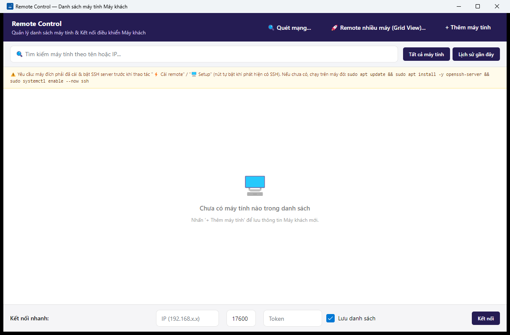
*Hình 1: Màn hình chính lần đầu mở — danh sách trống, kèm gợi ý "Nhấn '+ Thêm máy tính' để lưu thông tin Máy khách mới."*

### 3.2 Màn hình chính — Danh sách máy tính

**Mục đích:** Đây là nơi làm việc trung tâm — quản lý danh sách máy ZCU, xem nhanh trạng thái từng máy và mở mọi chức năng khác của phần mềm.

**Cách mở:** Tự mở khi khởi động ứng dụng.

#### 3.2.1 Bố cục màn hình

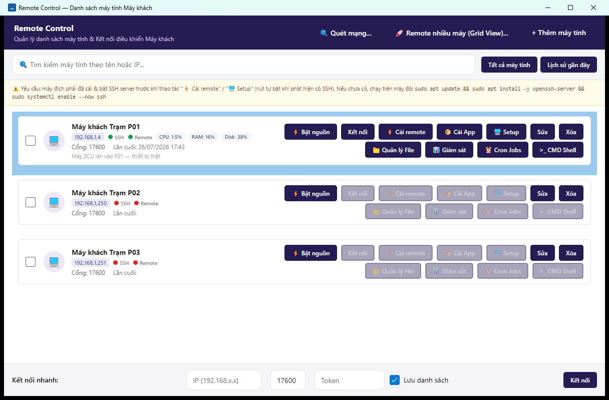
*Hình 2: Màn hình chính với danh sách máy đã lưu*

> ⏳ **[CHỜ ẢNH: `connection-entry-default.png` (bản cập nhật)]** — Chụp lại màn hình chính khi máy P01 đang online: chấm SSH + Remote màu xanh, có badge CPU/RAM/Disk hiển thị cạnh tên máy. Cần ZCU online + 3 máy dữ liệu mẫu. Ảnh hiện tại (Hình 2) là phiên bản máy offline.

Màn hình chính gồm các khu vực từ trên xuống dưới:

| Khu vực | Nội dung |
|---|---|
| **Thanh tiêu đề** (nền tím than) | Tên phần mềm + 3 nút: **🔍 Quét mạng...**, **🚀 Remote nhiều máy (Grid View)...**, **+ Thêm máy tính** |
| **Thanh tìm kiếm & lọc** | Ô "🔍 Tìm kiếm máy tính theo tên hoặc IP..." + 2 tab **Tất cả máy tính** / **Lịch sử gần đây** |
| **Dòng nhắc SSH** (nền vàng) | Nhắc rằng máy đích phải cài & bật SSH server trước khi dùng các nút **⚡ Cài remote** / **🖥️ Setup**, kèm sẵn câu lệnh cài SSH để gõ trên máy đích |
| **Danh sách máy** | Mỗi máy là một thẻ: ô tick chọn, tên máy, địa chỉ IP, trạng thái, các nút thao tác |
| **Thanh thao tác hàng loạt** (nền tối, chỉ hiện khi có máy được tick) | "Đã chọn N máy tính" + nút **🚀 Gửi lệnh / Upload File Hàng Loạt** |
| **Thanh "Kết nối nhanh"** (dưới cùng) | Nhập IP + cổng + Token để kết nối ngay một máy chưa có trong danh sách |

#### 3.2.2 Ý nghĩa trạng thái máy

Trên mỗi thẻ máy có 2 chấm tròn trạng thái, phần mềm tự kiểm tra định kỳ:

| Chấm | Màu xanh | Màu đỏ | Màu xám |
|---|---|---|---|
| **SSH** | Máy có SSH, sẵn sàng cho quản lý file/lệnh/cài đặt | Không kết nối được SSH | Đang kiểm tra |
| **Remote** | ZcuAgent đang chạy, sẵn sàng kết nối màn hình | Không thấy ZcuAgent | Đang kiểm tra |

Khi máy online, cạnh tên máy còn hiển thị thêm các ô nhỏ CPU / RAM / Ổ cứng cập nhật tự động.

Khi máy **offline**, các nút thao tác cần kết nối (Kết nối, ⚡ Cài remote, 📁 Quản lý File...) bị mờ đi, không bấm được:

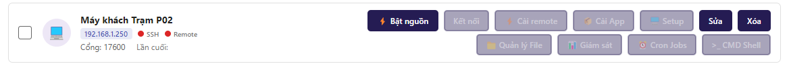
*Hình 3: Máy không kết nối được — chấm trạng thái đỏ, các nút thao tác bị mờ (không bấm được)*

#### 3.2.3 Các nút thao tác trên từng máy

Mỗi thẻ máy có 2 hàng nút bên phải:

**Hàng 1 — thao tác cơ bản:**

| Nút | Chức năng | Điều kiện bật |
|---|---|---|
| **⚡ Bật nguồn** | Bật máy từ xa bằng Wake-on-LAN (xem mục 8.1) | Luôn bấm được |
| **Kết nối** | Mở màn hình điều khiển từ xa (xem mục 5.1) | Chấm **Remote** xanh |
| **⚡ Cài remote** | Cài ZcuAgent từ xa (xem mục 9.1) | Chấm **SSH** xanh |
| **📦 Cài App** | Cài phần mềm lên máy ZCU (xem mục 9.2) | Chấm **SSH** xanh |
| **🖥️ Setup** | Triển khai chế độ Kiosk (xem mục 9.3) | Chấm **SSH** xanh |
| **Sửa** | Mở cửa sổ sửa thông tin máy (xem mục 4.1) | Luôn bấm được |
| **Xóa** | Xóa máy khỏi danh sách (xem mục 4.3) | Luôn bấm được |

**Hàng 2 — quản trị nâng cao (đều cần chấm SSH xanh):**

| Nút | Chức năng |
|---|---|
| **📁 Quản lý File** | Duyệt/gửi/xóa file trên máy ZCU (mục 6.1) |
| **📊 Giám sát** | Theo dõi CPU/RAM/ổ cứng (mục 7.1) |
| **⏰ Cron Jobs** | Lập lịch chạy định kỳ (mục 6.4) |
| **>_ CMD Shell** | Chạy lệnh từ xa (mục 6.2) |

> **Lưu ý:** Ngoài nút **Kết nối**, bạn cũng có thể **nhấp đúp** vào thẻ máy để mở màn hình điều khiển từ xa.

#### 3.2.4 Tìm kiếm và lọc danh sách

**Bước 1:** Gõ tên máy hoặc địa chỉ IP vào ô tìm kiếm phía trên danh sách.

**Kết quả mong đợi:** Danh sách được lọc ngay khi gõ, chỉ hiển thị các máy khớp từ khóa.

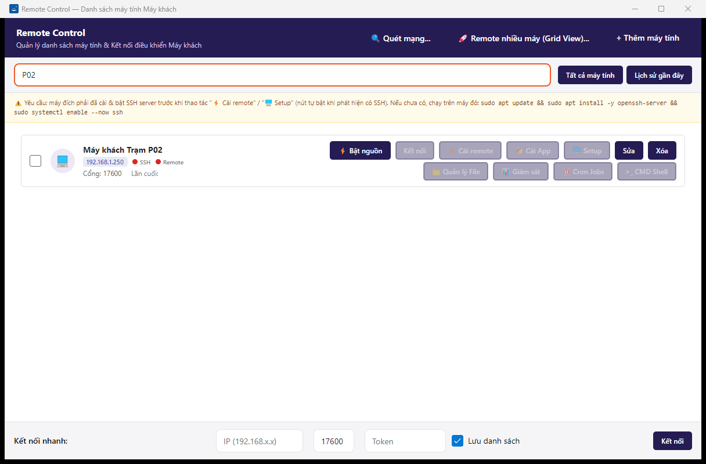
*Hình 4: Danh sách được lọc theo từ khóa đã gõ vào ô tìm kiếm*

**Bước 2 (tùy chọn):** Nhấp tab **Lịch sử gần đây** để chỉ xem những máy đã kết nối gần nhất; nhấp **Tất cả máy tính** để quay về danh sách đầy đủ.

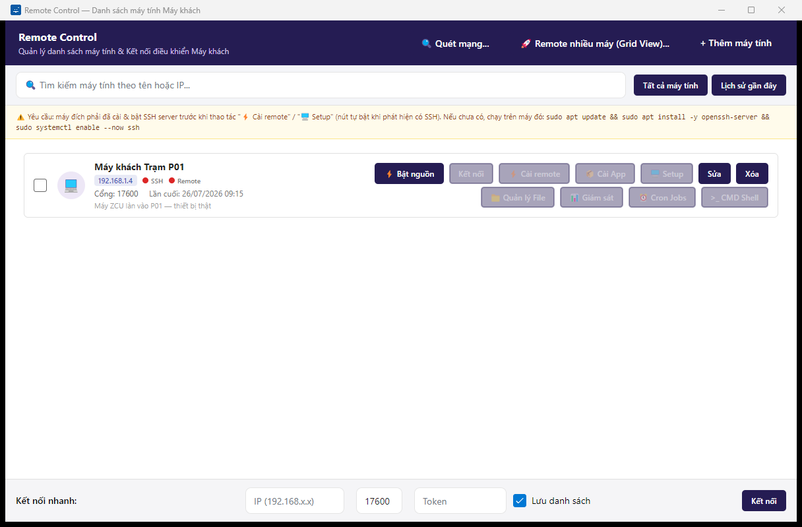
*Hình 5: Tab Lịch sử gần đây — hiển thị máy đã kết nối lần cuối*

#### 3.2.5 Chọn nhiều máy để thao tác hàng loạt

**Bước 1:** Tick vào ô vuông ở đầu thẻ của từng máy muốn chọn.

**Kết quả mong đợi:** Một thanh màu tối hiện ra ở cạnh dưới, thông báo "Đã chọn N máy tính" cùng nút **🚀 Gửi lệnh / Upload File Hàng Loạt** (chi tiết tại mục 6.3).

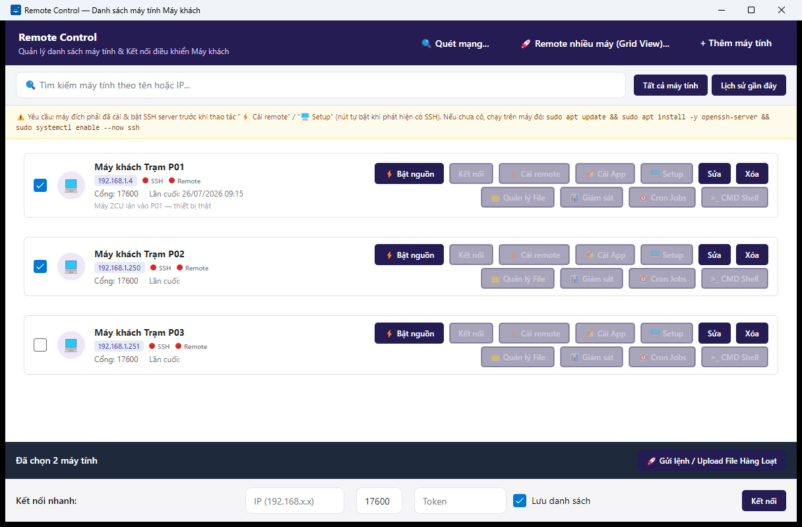
*Hình 6: Đã tick chọn 2 máy — thanh thao tác hàng loạt hiện ra ở cạnh dưới*

#### 3.2.6 Kết nối nhanh (không cần lưu trước)

Dùng khi muốn kết nối ngay tới một máy chưa có trong danh sách.

**Bước 1:** Ở thanh **Kết nối nhanh:** dưới cùng màn hình, gõ địa chỉ IP của máy (ví dụ `192.168.1.x`) vào ô đầu tiên.

**Bước 2:** Giữ nguyên cổng `17600` (hoặc sửa nếu máy đích dùng cổng khác).

**Bước 3:** Gõ Token của máy đích vào ô **Token**.

**Bước 4:** Muốn lưu máy này vào danh sách cho lần sau, giữ nguyên ô tick **Lưu danh sách** (mặc định đã bật).

**Bước 5:** Nhấn **Kết nối**.

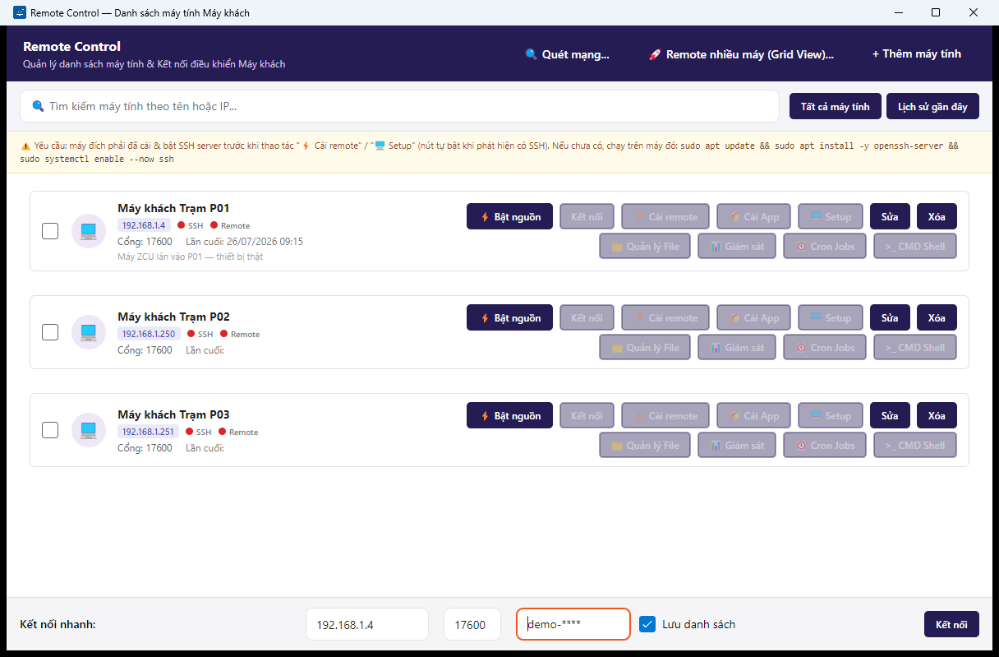
*Hình 7: Thanh Kết nối nhanh đã điền IP, cổng và Token, sẵn sàng bấm Kết nối*

**Kết quả mong đợi:** Cửa sổ điều khiển màn hình từ xa mở ra (xem mục 5.1).

> **Lưu ý:** Nếu bỏ trống ô IP rồi bấm **Kết nối**, phần mềm sẽ không làm gì (không có thông báo lỗi). Hãy kiểm tra đã điền IP trước khi bấm.

---

## 4. Quản lý danh sách máy tính

### 4.1 Thêm máy tính mới / Sửa thông tin máy

**Mục đích:** Nhập hoặc chỉnh sửa thông tin một máy ZCU: tên gợi nhớ, địa chỉ IP, cổng, Token, địa chỉ MAC và tài khoản SSH.

**Cách mở:**
- Thêm mới: từ màn hình chính, nhấn **+ Thêm máy tính** (góc trên bên phải).
- Sửa: nhấn nút **Sửa** trên thẻ máy tương ứng.
- Ngoài ra, khi quét mạng tìm thấy máy (mục 4.2), bấm **Thêm** cũng mở cửa sổ này với thông tin điền sẵn.

#### 4.1.1 Các trường thông tin

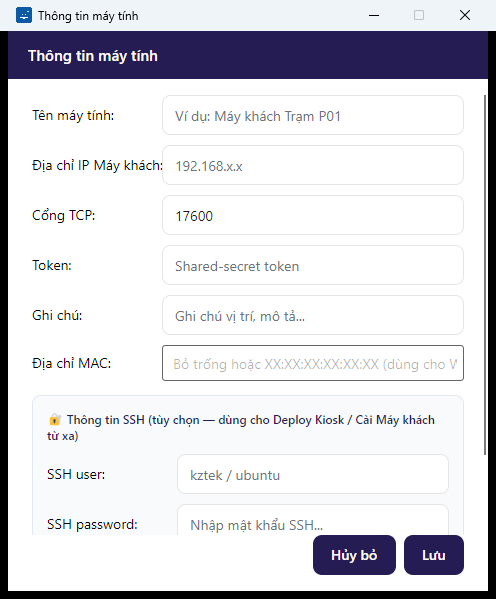
*Hình 8: Cửa sổ "Thông tin máy tính" khi thêm mới — cổng TCP mặc định 17600, cổng SSH mặc định 22*

| Trường | Ý nghĩa | Bắt buộc? |
|---|---|---|
| **Tên máy tính** | Tên gợi nhớ hiển thị trong danh sách (ví dụ: Máy khách Trạm P01) | Nên điền |
| **Địa chỉ IP Máy khách** | Địa chỉ IP của máy ZCU trong mạng LAN (ví dụ `192.168.1.x`) | Cần cho kết nối |
| **Cổng TCP** | Cổng của ZcuAgent — giữ `17600` trừ khi kỹ thuật viên chỉ định khác | Có sẵn |
| **Token** | Mã bảo mật — phải trùng với Token đã cài trên máy ZCU | Cần cho kết nối |
| **Ghi chú** | Ghi chú vị trí, mô tả tùy ý | Không |
| **Địa chỉ MAC** | Dạng `XX:XX:XX:XX:XX:XX` — chỉ cần khi muốn dùng Bật nguồn từ xa (mục 8.1) | Không |
| **🔐 Thông tin SSH** (khối riêng) | **SSH user** (ví dụ `<tên người dùng>`), **SSH password** (hiển thị dạng `••••••`), **Cổng SSH** (mặc định 22) — cần cho Quản lý File, chạy lệnh, cài đặt từ xa | Không, nhưng nên điền |

#### 4.1.2 Các bước thêm máy mới

**Bước 1:** Nhấn **+ Thêm máy tính** trên màn hình chính.

**Bước 2:** Gõ tên máy, địa chỉ IP và Token vào các ô tương ứng.

**Bước 3 (khuyến nghị):** Điền khối **🔐 Thông tin SSH** (tài khoản và mật khẩu đăng nhập của máy ZCU) để dùng được đầy đủ chức năng quản trị.

**Bước 4 (tùy chọn):** Điền **Địa chỉ MAC** nếu muốn bật nguồn máy từ xa sau này.

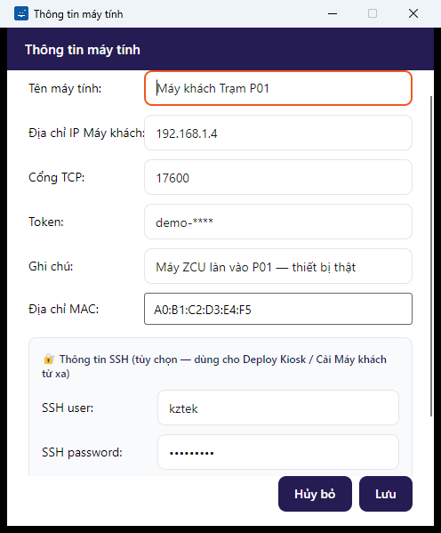
*Hình 9: Form đã điền đủ thông tin máy, mật khẩu SSH tự động hiển thị dạng chấm tròn*

**Bước 5:** Nhấn **Lưu**. (Nhấn **Hủy bỏ** nếu muốn thoát mà không lưu.)

**Kết quả mong đợi:** Cửa sổ đóng lại, máy mới xuất hiện trong danh sách ở màn hình chính. Phần mềm bắt đầu tự kiểm tra trạng thái SSH/Remote của máy.

> **Lưu ý:** Phần mềm cho phép **Lưu** kể cả khi còn ô bỏ trống (ví dụ chỉ điền MAC để dùng bật nguồn từ xa). Vì vậy hãy tự kiểm tra lại IP và Token đã đúng chưa — nếu sai, máy sẽ hiển thị trạng thái đỏ trong danh sách.

#### 4.1.3 Sửa thông tin máy

**Bước 1:** Nhấn **Sửa** trên thẻ máy cần chỉnh.

**Bước 2:** Cửa sổ mở ra với dữ liệu hiện tại đã được nạp sẵn — sửa các ô cần thay đổi.


*Hình 10: Mở bằng nút Sửa — thông tin cũ của máy được nạp sẵn để chỉnh*

**Bước 3:** Nhấn **Lưu**.

**Kết quả mong đợi:** Thông tin máy trong danh sách được cập nhật ngay.

### 4.2 Quét mạng tìm máy ZCU tự động

**Mục đích:** Tự động dò cả dải mạng LAN để tìm những máy đã cài Remote Agent, thay vì gõ tay từng IP. Phần mềm xác nhận bằng "bắt tay" giao thức thật nên kết quả tin cậy (không chỉ dò cổng mở).

**Cách mở:** Màn hình chính → nhấn **🔍 Quét mạng...**

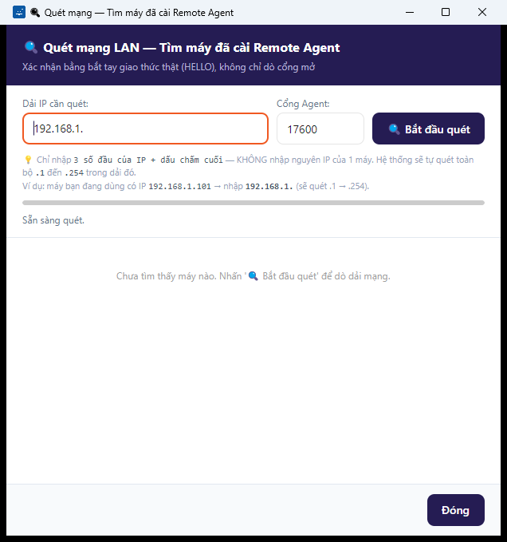
*Hình 11: Cửa sổ Quét mạng — nhập dải IP, cổng Agent mặc định 17600, trạng thái "Sẵn sàng quét."*

**Các bước thực hiện:**

**Bước 1:** Ở ô **Dải IP cần quét**, gõ **3 số đầu của dải IP kèm dấu chấm cuối** — ví dụ máy bạn có IP `192.168.1.101` thì gõ `192.168.1.` (phần mềm sẽ tự quét từ `.1` đến `.254`). Không gõ nguyên IP của một máy.

**Bước 2:** Giữ nguyên **Cổng Agent** `17600` (hoặc sửa theo hệ thống của bạn).

**Bước 3:** Nhấn **🔍 Bắt đầu quét**.

**Kết quả mong đợi:** Thanh tiến trình chạy, dòng trạng thái hiển thị tiến độ quét:

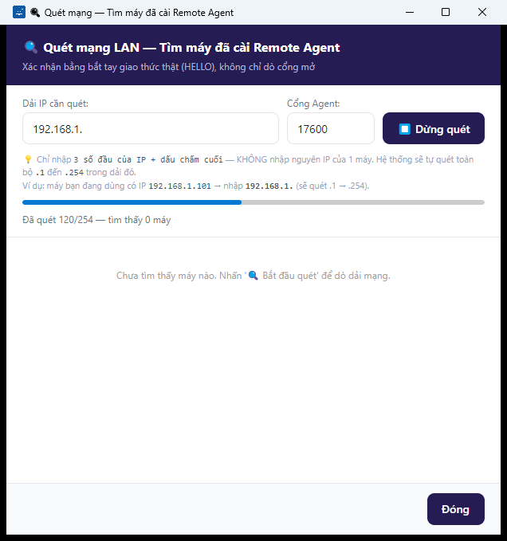
*Hình 12: Thanh tiến trình đang chạy trong lúc quét dải mạng*

Khi tìm thấy máy, mỗi máy hiện thành một thẻ gồm tên máy, địa chỉ IP, độ phân giải màn hình và nút **Thêm**:

> ⏳ **[CHỜ ẢNH: `network-scan-results.png`]** — Chụp cửa sổ Quét mạng sau khi tìm thấy máy ZCU thật: thẻ kết quả có tên máy, IP, độ phân giải và nút Thêm. Cần ZCU online với ZcuAgent đang chạy.

**Bước 4:** Nhấn **Thêm** trên máy muốn lưu → cửa sổ "Thông tin máy tính" (mục 4.1) mở ra với thông tin điền sẵn, bổ sung Token/SSH rồi **Lưu**.

**Bước 5:** Nhấn **Đóng** khi xong.

> **Lưu ý:** Nếu quét xong mà danh sách vẫn hiện "Chưa tìm thấy máy nào", hãy kiểm tra: máy ZCU đã bật chưa, đã cài ZcuAgent chưa (Phần 2), và cổng nhập ở Bước 2 có đúng không.

### 4.3 Xóa máy khỏi danh sách

**Bước 1:** Nhấn **Xóa** trên thẻ máy cần loại bỏ.

**Kết quả:** Máy bị xóa khỏi danh sách **ngay lập tức**.

> ⚠️ **Cảnh báo:** Thao tác xóa máy **không có hộp thoại hỏi lại** — bấm là xóa ngay. Nếu lỡ xóa nhầm, bạn phải thêm lại máy bằng **+ Thêm máy tính** (mục 4.1) và nhập lại toàn bộ thông tin. Việc xóa chỉ ảnh hưởng danh sách trên máy CCU, không tác động gì đến máy ZCU.

---

## 5. Điều khiển màn hình từ xa

### 5.1 Kết nối và xem màn hình một máy

**Mục đích:** Xem trực tiếp màn hình máy ZCU và điều khiển bằng chuột, bàn phím của bạn; kèm các tiện ích chat, đồng bộ clipboard, ghi hình và che màn hình riêng tư.

**Cách mở:** Từ màn hình chính — một trong ba cách:
- Nhấn nút **Kết nối** trên thẻ máy (cần chấm **Remote** xanh), hoặc
- Nhấp đúp vào thẻ máy, hoặc
- Dùng thanh **Kết nối nhanh** (mục 3.2.6).

#### 5.1.1 Kết nối / ngắt kết nối

Ngay khi mở, cửa sổ hiển thị trạng thái đang kết nối ở thanh trên cùng:


*Hình 13: Cửa sổ điều khiển từ xa vừa mở — thanh trạng thái báo đang kết nối tới máy đích*

Khi kết nối thành công, màn hình máy ZCU hiện ra ở vùng giữa, chấm trạng thái chuyển xanh và các nút công cụ được bật:

> ⏳ **[CHỜ ẢNH: `remote-screen-streaming.png`]** — Chụp cửa sổ đang hiển thị màn hình ZCU thật: chấm trạng thái xanh, các nút 🕶️ Privacy / 📊 SysInfo / 🔴 Record / Ngắt kết nối đã bật. Cần ZCU online. (Ảnh này đồng thời minh họa vùng hiển thị RemoteScreenControl ở mục 5.1.2.)

**Ngắt kết nối:** Nhấn nút **Ngắt kết nối** (màu đỏ, góc trên bên phải).

> ⏳ **[CHỜ ẢNH: `remote-screen-disconnected.png`]** — Chụp cửa sổ sau khi bấm Ngắt kết nối: trạng thái đổi, các nút công cụ mờ đi. Cần ZCU online để có phiên trước khi ngắt.

**Trường hợp máy chưa có SSH:** Nếu phần mềm phát hiện máy đích chưa cài SSH, một dòng nhắc màu xanh nhạt hiện dưới thanh trạng thái, kèm sẵn câu lệnh cài SSH để gõ trên máy đích:

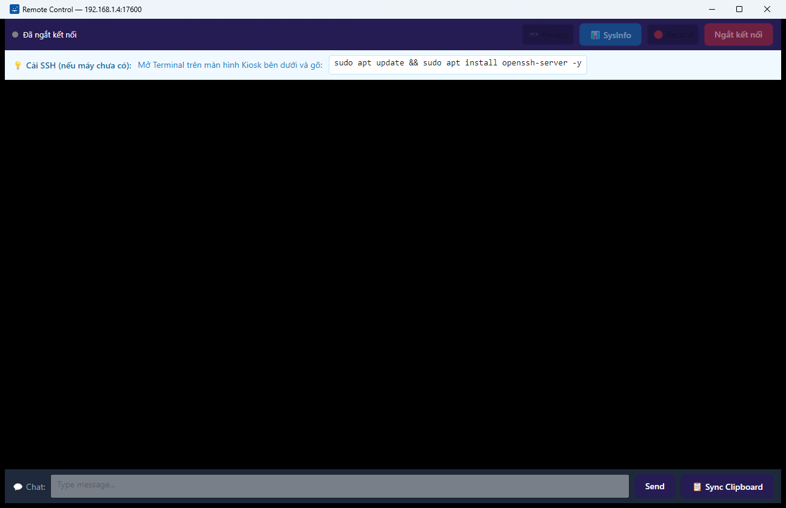
*Hình 14: Dòng nhắc "💡 Cài SSH (nếu máy chưa có)" kèm câu lệnh cài đặt có thể sao chép*

**Trường hợp lỗi kết nối:** Nếu không thể kết nối tới máy (sai địa chỉ, máy tắt, sai Token...), sau nhiều lần tự thử lại phần mềm hiển thị dải thông báo lỗi màu đỏ:

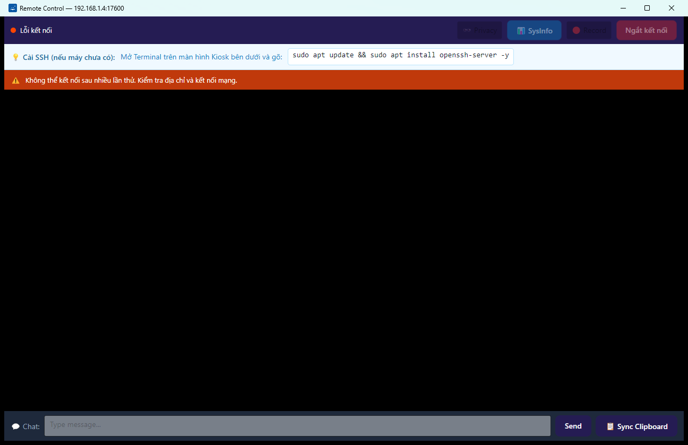
*Hình 15: Không thể kết nối sau nhiều lần thử — dải đỏ báo lỗi kèm hướng khắc phục "Kiểm tra địa chỉ và kết nối mạng."*

> **Lưu ý:** Khi mất kết nối giữa chừng, phần mềm tự thử kết nối lại nhiều lần trước khi báo lỗi — hãy chờ trong giây lát. Nếu vẫn lỗi, kiểm tra máy ZCU còn bật không và Token có đúng không (mục 4.1).

#### 5.1.2 Vùng hiển thị & điều khiển chuột, bàn phím

Vùng giữa cửa sổ chính là màn hình máy ZCU truyền về theo thời gian thực:

- **Di chuột, nhấp chuột, nhấp đúp, cuộn** trong vùng này → thao tác được thực hiện y hệt trên máy ZCU.
- **Gõ bàn phím** khi cửa sổ đang được chọn → ký tự được gửi sang máy ZCU.

*(Ảnh minh họa dùng chung với ảnh đang kết nối ở mục 5.1.1 — xem marker `remote-screen-streaming.png`.)*

#### 5.1.3 Chat với người dùng máy ZCU

Thanh **💬 Chat:** nằm ở cạnh dưới cửa sổ.

**Bước 1:** Gõ nội dung vào ô nhập tin nhắn.

**Bước 2:** Nhấn **Send** (hoặc phím Enter).

**Kết quả mong đợi:** Tin nhắn hiển thị trên màn hình máy ZCU để người ngồi tại máy đó đọc được.

> ⏳ **[CHỜ ẢNH: `remote-screen-chat.png`]** — Chụp thanh chat sau khi đã gõ và gửi một tin nhắn. Cần phiên kết nối thật với ZCU.

#### 5.1.4 Đồng bộ clipboard hai chiều

Nhấn **📋 Sync Clipboard** (cạnh dưới, bên phải) để đồng bộ nội dung đã sao chép giữa máy CCU và máy ZCU — sau đó có thể dán (Ctrl+V) ở máy bên kia.

> ⏳ **[CHỜ ẢNH: `remote-screen-clipboard-sync.png`]** — Chụp sau khi bấm 📋 Sync Clipboard (nếu có phản hồi giao diện). Cần phiên kết nối thật. *Ảnh best-effort — có thể bỏ qua nếu không có thay đổi trực quan.*

#### 5.1.5 Ghi hình phiên làm việc

**Bước 1:** Nhấn nút **🔴 Record** trên thanh công cụ (chỉ bật khi đang kết nối).

**Kết quả mong đợi:** Nút chuyển sang trạng thái đang ghi; toàn bộ hình ảnh phiên làm việc được ghi thành file video (định dạng AVI) trên máy CCU.

**Bước 2:** Nhấn **🔴 Record** lần nữa để dừng ghi.

> ⏳ **[CHỜ ẢNH: `remote-screen-record-on.png`]** — Chụp thanh công cụ khi nút 🔴 Record đang ở trạng thái bật (đang ghi hình). Cần phiên kết nối thật.

#### 5.1.6 Che màn hình riêng tư (Privacy)

**Bước 1:** Nhấn **🕶️ Privacy** trên thanh công cụ (chỉ bật khi đang kết nối).

**Kết quả mong đợi:** Màn hình vật lý của máy ZCU bị che tối — người đứng cạnh máy ZCU không nhìn thấy thao tác bạn đang làm; bạn vẫn thấy và điều khiển bình thường từ CCU.

**Bước 2:** Nhấn **🕶️ Privacy** lần nữa để mở lại màn hình cho máy ZCU.

> ⏳ **[CHỜ ẢNH: `remote-screen-privacy-on.png`]** — Chụp khi toggle 🕶️ Privacy đang bật (màn hình đích bị che). Cần phiên kết nối thật.

> **Lưu ý:** Nút **📊 SysInfo** trên cùng thanh công cụ mở cửa sổ thông tin cấu hình máy — xem mục 7.2.

### 5.2 Điều khiển nhiều máy cùng lúc — Multi-Remote Dashboard

**Mục đích:** Theo dõi và điều khiển nhiều máy ZCU song song trên một cửa sổ: dạng lưới 2x2, 3x3, lưới tùy chỉnh, hoặc dạng thẻ tab.

**Cách mở:** Màn hình chính → nhấn **🚀 Remote nhiều máy (Grid View)...** Phần mềm tự nạp các máy đã lưu vào lưới.

#### 5.2.1 Bố cục và trạng thái rỗng

Thanh trên cùng gồm: bộ đếm "N phiên đang kết nối", cụm **Chế độ xem** (các nút **Lưới 2x2**, **Lưới 3x3**, ô nhập lưới tùy chỉnh + **Áp dụng**, **Thẻ Tab**) và 2 nút **+ Thêm máy**, **❌ Ngắt tất cả**.

Khi chưa có phiên nào (danh sách trống hoặc sau khi Ngắt tất cả):

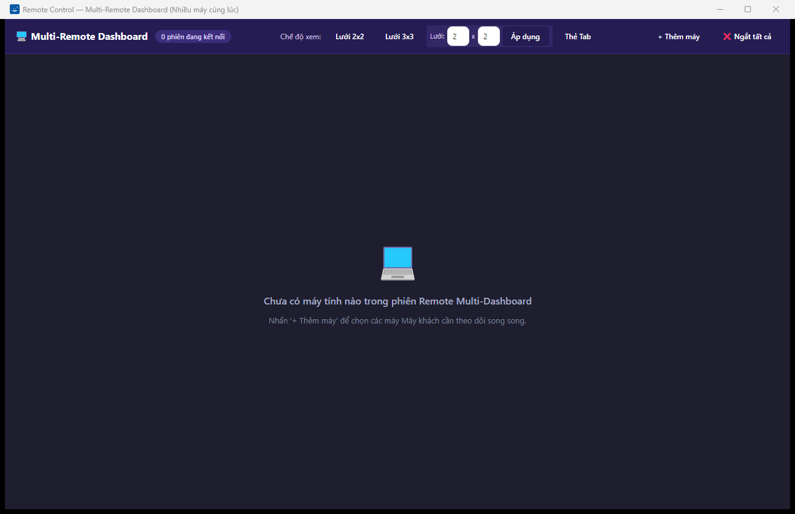
*Hình 16: Multi-Remote Dashboard khi chưa có máy nào — gợi ý "Nhấn '+ Thêm máy' để chọn các máy Máy khách cần theo dõi song song."*

#### 5.2.2 Thêm phiên vào lưới — hộp thoại chọn máy

**Bước 1:** Nhấn **+ Thêm máy** ở góc trên bên phải.

**Bước 2:** Trong hộp thoại "Chọn máy cần theo dõi", nhấp chọn một hoặc nhiều máy (nhấp để bật/tắt chọn, có thể giữ Ctrl). Máy đã có trong Dashboard không hiển thị ở đây.

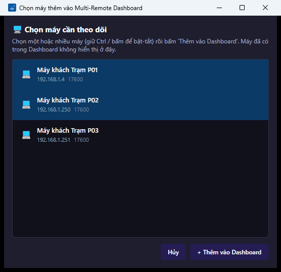
*Hình 17: Hộp thoại chọn máy thêm vào Dashboard — chọn một hoặc nhiều máy rồi bấm "+ Thêm vào Dashboard"*

**Bước 3:** Nhấn **+ Thêm vào Dashboard** (hoặc **Hủy** để thoát).

**Kết quả mong đợi:** Các máy được chọn xuất hiện thành từng ô trong lưới, mỗi ô tự kết nối tới máy tương ứng.

> ⏳ **[CHỜ ẢNH: `multi-remote-grid-2x2.png`]** — Chụp lưới 2x2 có phiên ZCU live (1 ô hiển thị màn hình thật + các ô trống). Cần ZCU online + dữ liệu mẫu.

#### 5.2.3 Đổi chế độ xem, đóng phiên

- Nhấn **Lưới 2x2** hoặc **Lưới 3x3** để đổi nhanh bố cục lưới.
- Muốn lưới kích thước khác: gõ số hàng và số cột vào 2 ô nhỏ cạnh chữ **Lưới:** rồi nhấn **Áp dụng**.

> ⏳ **[CHỜ ẢNH: `multi-remote-custom-grid.png`]** — Chụp sau khi nhập lưới tùy chỉnh (ví dụ 1x2) và bấm Áp dụng, có phiên live. Cần ZCU online.

- Nhấn **Thẻ Tab** để chuyển sang dạng mỗi máy một thẻ, xem từng máy toàn màn hình:

> ⏳ **[CHỜ ẢNH: `multi-remote-tab-view.png`]** — Chụp chế độ Thẻ Tab với tab phiên đang mở. Cần ZCU online.

- Nhấn **❌ Ngắt tất cả** để đóng toàn bộ phiên và quay về trạng thái rỗng.

---

## 6. Quản lý file & thực thi lệnh từ xa

### 6.1 Trình quản lý file qua SFTP

**Mục đích:** Duyệt thư mục trên máy ZCU, tải file lên, đồng bộ thư mục và xóa file/thư mục — tương tự trình quản lý file quen thuộc, hoạt động qua kênh SFTP an toàn.

**Cách mở:** Màn hình chính → nhấn **📁 Quản lý File** trên thẻ máy (cần chấm **SSH** xanh).

#### 6.1.1 Bố cục và duyệt thư mục

> ⏳ **[CHỜ ẢNH: `file-manager-default.png`]** — Chụp cửa sổ Quản Lý File vừa mở: danh sách file thư mục nhà của người dùng, bảng 4 cột (Tên File / Loại / Kích thước / Ngày sửa), thanh trạng thái "Sẵn sàng". Cần SSH tới ZCU.

Các thành phần chính:

| Thành phần | Chức năng |
|---|---|
| **⬆ Lên 1 cấp** | Quay lên thư mục cha |
| Ô đường dẫn + **Đi** | Gõ đường dẫn muốn tới rồi nhấn **Đi** |
| **🔄 Làm mới** | Tải lại danh sách file |
| **🔄 Đồng bộ** | Đồng bộ một thư mục trên máy bạn lên thư mục đang mở trên máy ZCU |
| **⬆ Upload File** | Chọn file từ máy bạn để tải lên |
| **🗑 Xóa** | Xóa file/thư mục đang chọn (có hộp thoại xác nhận) |
| Ô **Lọc file** | Gõ tên để lọc danh sách |
| Bảng danh sách | 4 cột: Tên File, Loại, Kích thước, Ngày sửa — nhấp để chọn, giữ Ctrl chọn nhiều |
| Thanh trạng thái (dưới cùng) | Hiển thị kết quả thao tác gần nhất |

**Duyệt vào thư mục con:** Nhấp đúp tên thư mục trong danh sách, hoặc gõ đường dẫn vào ô phía trên rồi nhấn **Đi**.

> ⏳ **[CHỜ ẢNH: `file-manager-navigate.png`]** — Chụp sau khi vào một thư mục con (dữ liệu mẫu `kztek-demo/`), thanh đường dẫn thay đổi. Cần SSH + dữ liệu mẫu trên ZCU.

**Lọc danh sách:** Gõ một phần tên file vào ô **Lọc file** — danh sách thu hẹp ngay khi gõ.

> ⏳ **[CHỜ ẢNH: `file-manager-filter.png`]** — Chụp ô Lọc file đã gõ từ khóa, danh sách được lọc. Cần SSH + dữ liệu mẫu.

**Tải file lên:**

**Bước 1:** Mở tới thư mục đích trên máy ZCU.

**Bước 2:** Nhấn **⬆ Upload File** và chọn file từ máy của bạn. (Cũng có thể **kéo-thả** file từ máy tính thẳng vào danh sách.)

**Kết quả mong đợi:** Thanh trạng thái báo tải lên thành công, file mới xuất hiện trong danh sách.

> ⏳ **[CHỜ ẢNH: `file-manager-upload-success.png`]** — Chụp thanh trạng thái sau khi Upload File thành công (file mẫu `demo-upload.txt`). Cần SSH + dữ liệu mẫu.

**Đồng bộ thư mục:** Nhấn **🔄 Đồng bộ**, chọn một thư mục trên máy bạn — phần mềm đối chiếu và tải lên những file có thay đổi vào thư mục đang mở trên máy ZCU.

> ⏳ **[CHỜ ẢNH: `file-manager-sync-result.png`]** — Chụp thanh trạng thái sau khi Đồng bộ thư mục xong. Cần SSH + dữ liệu mẫu.

**Trường hợp lỗi:** Nếu mất kết nối tới máy ZCU giữa chừng, thanh trạng thái hiển thị thông báo lỗi — kiểm tra lại mạng và trạng thái SSH của máy rồi nhấn **🔄 Làm mới**.

> ⏳ **[CHỜ ẢNH: `file-manager-error-connect.png`]** — Chụp thông báo lỗi ở thanh trạng thái khi không kết nối được/mất kết nối giữa chừng. *Ảnh best-effort — khó tái tạo chủ đích.*

#### 6.1.2 Xóa file/thư mục — xác nhận trước khi xóa

**Bước 1:** Chọn một hoặc nhiều file/thư mục trong danh sách (giữ Ctrl để chọn nhiều).

**Bước 2:** Nhấn **🗑 Xóa**.

**Kết quả:** Hộp thoại **"Xác nhận xóa"** hiện ra, liệt kê đầy đủ các mục sắp bị xóa vĩnh viễn trên máy đích:

> ⏳ **[CHỜ ẢNH: `confirm-delete-default.png`]** — Chụp hộp thoại Xác nhận xóa (nền tối) liệt kê file sắp xóa + 2 nút Hủy / 🗑 Xóa vĩnh viễn. Cần SSH + dữ liệu mẫu.

**Bước 3:** Đọc kỹ danh sách, nhấn **🗑 Xóa vĩnh viễn** để thực hiện, hoặc **Hủy** để thoát.

> ⚠️ **Cảnh báo:** Nếu trong danh sách có **thư mục**, hộp thoại hiển thị thêm dòng cảnh báo đỏ: toàn bộ nội dung bên trong thư mục sẽ bị xóa đệ quy và **không thể khôi phục**. Hãy chắc chắn trước khi xác nhận.

> ⏳ **[CHỜ ẢNH: `confirm-delete-dir-warning.png`]** — Chụp hộp thoại khi có THƯ MỤC trong danh sách xóa — dòng cảnh báo đỏ "xóa đệ quy" hiện ra. Cần SSH + dữ liệu mẫu.

**Kết quả mong đợi sau khi xóa:** Danh sách được cập nhật, thanh trạng thái báo đã xóa xong.

> ⏳ **[CHỜ ẢNH: `file-manager-after-delete.png`]** — Chụp thanh trạng thái sau khi xóa file thành công. Cần SSH + dữ liệu mẫu.

### 6.2 Chạy lệnh từ xa qua SSH ⚙️ nâng cao

**Mục đích:** Gửi lệnh cho máy ZCU thực hiện và xem kết quả trả về; kèm một tab truyền nhận file thứ hai. Dành cho kỹ thuật viên hoặc người vận hành được hướng dẫn cụ thể.

**Cách mở:** Màn hình chính → nhấn **>_ CMD Shell** trên thẻ máy (cần chấm **SSH** xanh).

Cửa sổ "Quản lý File & Lệnh (SFTP / SSH)" có 2 tab:

#### 6.2.1 Tab ">_ Console (CMD)" — chạy lệnh

> ⏳ **[CHỜ ẢNH: `remote-command-console-default.png`]** — Chụp tab Console vừa mở: ô Sudo password, ô nhập lệnh, vùng kết quả trống. Cần SSH tới ZCU.

**Bước 1 (nếu lệnh cần quyền quản trị):** Gõ mật khẩu sudo vào ô đầu tiên — để trống nếu giống mật khẩu SSH.

**Bước 2:** Gõ lệnh cần chạy vào ô lệnh. Có thể gõ từ khóa (ví dụ "RAM") vào ô gợi ý bên cạnh để chọn nhanh một lệnh mẫu có sẵn:

> ⏳ **[CHỜ ẢNH: `remote-command-snippet.png`]** — Chụp danh sách gợi ý lệnh mẫu đang mở khi gõ từ khóa (ví dụ "RAM"). Cần SSH.

**Bước 3:** Nhấn **🚀 Chạy lệnh**.

**Kết quả mong đợi:** Kết quả hiện trong khung **💻 Kết quả trả về (Console Output)**:

> ⏳ **[CHỜ ẢNH: `remote-command-console-output.png`]** — Chụp kết quả một lệnh vô hại (ví dụ `uname -a` hoặc `df -h`) trong Console Output. Cần SSH.

**Trường hợp lỗi:** Lệnh sai hoặc mất kết nối → thông báo lỗi màu cam hiện ở thanh trạng thái dưới cùng.

> ⏳ **[CHỜ ẢNH: `remote-command-error.png`]** — Chụp thông báo lỗi tiêu biểu ở thanh trạng thái (lệnh sai / mất kết nối). Cần SSH.

> ⚠️ **Cảnh báo:** Lệnh chạy từ xa tác động trực tiếp lên máy ZCU. Chỉ chạy lệnh bạn hiểu rõ hoặc được kỹ thuật viên cung cấp.

#### 6.2.2 Tab "📁 Truyền nhận File (SFTP)"

Tab này cung cấp bộ công cụ file thứ hai ngay trong cửa sổ lệnh: **⬆️ Lên** (lên thư mục cha), ô đường dẫn, **🔄 Tải lại**, **🔄 Sync (Local > Remote)** (đồng bộ thư mục máy bạn lên máy đích), **📤 Upload File** (hỗ trợ kéo-thả nhiều file cùng lúc), **📥 Download** (tải file/thư mục đang chọn về máy bạn), **🗑️ Xóa** (có hộp thoại xác nhận như mục 6.1.2). Nhấp đúp thư mục để mở.

> ⏳ **[CHỜ ẢNH: `remote-command-sftp-tab.png`]** — Chụp tab Truyền nhận File: khung nhắc vàng + thanh công cụ Upload/Download/Xóa + danh sách file. Cần SSH.

> **Lưu ý:** Khác với mục 6.1, tab này có thêm nút **📥 Download** để tải file từ máy ZCU về máy của bạn.

### 6.3 Thao tác hàng loạt trên nhiều máy ⚙️ nâng cao

**Mục đích:** Chạy cùng một lệnh hoặc tải cùng một file lên **nhiều máy** cùng lúc, xem kết quả thành công/thất bại của từng máy.

**Cách mở:** Màn hình chính → tick chọn từ 1 máy trở lên (mục 3.2.5) → nhấn **🚀 Gửi lệnh / Upload File Hàng Loạt** ở thanh dưới.

> ⏳ **[CHỜ ẢNH: `bulk-action-default.png`]** — Chụp cửa sổ Thực thi hàng loạt vừa mở: ô nhập lệnh + danh sách máy đã tick chưa chạy. Cần SSH + dữ liệu mẫu (1 máy online + 1 máy offline).

**Các bước thực hiện:**

**Bước 1:** Gõ lệnh vào ô lệnh (hoặc chọn lệnh mẫu qua ô gợi ý như mục 6.2.1).

**Bước 2:** Nhấn **🚀 Chạy lệnh** — hoặc nhấn **📤 Upload File** nếu muốn gửi file thay vì chạy lệnh.

**Kết quả mong đợi:** Khung tiến trình hiện "Đang xử lý: n/N" trong lúc chạy lần lượt từng máy:

> ⏳ **[CHỜ ẢNH: `bulk-action-running.png`]** — Chụp khung tiến trình "Đang xử lý: n/N" đang chạy. Cần SSH + dữ liệu mẫu.

Sau khi xong, danh sách kết quả hiển thị từng máy: biểu tượng xanh kèm kết quả trả về nếu thành công, biểu tượng đỏ nếu thất bại (máy tắt, sai SSH...):

> ⏳ **[CHỜ ẢNH: `bulk-action-results.png`]** — Chụp danh sách kết quả: 1 máy thành công (icon xanh + output) và 1 máy thất bại (icon đỏ) trong cùng 1 ảnh. Cần SSH + dữ liệu mẫu.

> ⚠️ **Cảnh báo:** Lệnh hàng loạt tác động lên tất cả máy đã tick cùng lúc — kiểm tra kỹ danh sách máy và nội dung lệnh trước khi chạy.

### 6.4 Lập lịch công việc định kỳ — Cron ⚙️ nâng cao

**Mục đích:** Xem, thêm, xóa các công việc chạy tự động theo lịch (cron) trên máy ZCU — ví dụ tự sao lưu lúc 3 giờ sáng hằng ngày.

**Cách mở:** Màn hình chính → nhấn **⏰ Cron Jobs** trên thẻ máy (cần chấm **SSH** xanh).

> ⏳ **[CHỜ ẢNH: `cron-job-default.png`]** — Chụp cửa sổ Quản Lý Cron Jobs vừa mở: bảng danh sách lịch hiện có (có thể rỗng) + khung "Thêm Cron Job Mới" bên phải. Cần SSH.

Cửa sổ gồm 2 phần: bên trái là bảng lịch hiện có (cột **Lịch trình** và **Lệnh**, kèm nút **🔄 Tải lại**, **🗑 Xóa mục chọn**); bên phải là khung **Thêm Cron Job Mới**.

**Thêm lịch mới:**

**Bước 1:** Điền 5 ô thời gian: **Phút**, **Giờ**, **Ngày**, **Tháng**, **Thứ**. Dấu `*` nghĩa là "mọi giá trị". Ví dụ chạy 3:00 sáng hằng ngày: Phút = `0`, Giờ = `3`, còn lại giữ `*`.

**Bước 2:** Gõ lệnh hoặc đường dẫn tập tin cần chạy vào ô **Lệnh (Command)**.

**Bước 3:** Nhấn **➕ Thêm Job**.

**Kết quả mong đợi:** Lịch mới xuất hiện trong bảng bên trái, thanh trạng thái báo thành công:

> ⏳ **[CHỜ ẢNH: `cron-job-added.png`]** — Chụp sau khi ➕ Thêm Job: lịch mẫu xuất hiện trong bảng + thanh trạng thái. Cần SSH + dữ liệu mẫu.

**Xóa lịch:** Nhấp chọn dòng trong bảng → nhấn **🗑 Xóa mục chọn**.

> ⏳ **[CHỜ ẢNH: `cron-job-after-delete.png`]** — Chụp sau khi xóa: lịch biến mất khỏi bảng + thanh trạng thái. Cần SSH + dữ liệu mẫu.

> ⚠️ **Cảnh báo:** Lịch cron chạy tự động lặp lại trên máy ZCU kể cả khi không ai theo dõi. Chỉ thêm lệnh đã được kiểm chứng; xóa lịch không dùng nữa để tránh máy chạy lệnh ngoài ý muốn.

---

## 7. Giám sát hệ thống

### 7.1 Theo dõi sức khỏe máy

**Mục đích:** Xem mức sử dụng CPU, RAM, ổ cứng và danh sách tiến trình chiếm tài nguyên nhiều nhất trên máy ZCU, số liệu tự cập nhật định kỳ.

**Cách mở:** Màn hình chính → nhấn **📊 Giám sát** trên thẻ máy (cần chấm **SSH** xanh).

Khi vừa mở, các ô số liệu hiển thị `--%` và trạng thái "Đang kết nối...":

> ⏳ **[CHỜ ẢNH: `health-monitor-loading.png`]** — Chụp cửa sổ Giám Sát Sức Khỏe lúc vừa mở: các ô "--%", trạng thái "Đang kết nối...". Cần SSH.

**Kết quả mong đợi:** Sau vài giây, 3 ô **CPU**, **RAM**, **Ổ cứng ( / )** hiển thị số liệu thật, kèm bảng **Top Process Đang Chạy** (các cột PID, Người dùng, CPU %, RAM %, Lệnh):

> ⏳ **[CHỜ ẢNH: `health-monitor-data.png`]** — Chụp khi CPU/RAM/Ổ cứng có số liệu thật + bảng Top Process. Cần SSH.

- Nhấn **🔄 Làm mới ngay** để cập nhật tức thì (ngoài chu kỳ tự động).
- Nhấn **Đóng** khi xong.

> **Lưu ý:** Nếu số liệu mãi không hiện, kiểm tra chấm **SSH** của máy trên màn hình chính còn xanh không.

### 7.2 Xem thông tin cấu hình máy ZCU

**Mục đích:** Xem nhanh cấu hình máy ZCU: bộ vi xử lý (CPU), dung lượng RAM, hệ điều hành và kiến trúc.

**Cách mở:** Trong cửa sổ điều khiển từ xa **đang kết nối** (mục 5.1) → nhấn **📊 SysInfo** trên thanh công cụ.

**Kết quả mong đợi:** Cửa sổ "System Inventory" hiện 4 mục: **CPU**, **Memory (RAM)**, **Operating System**, **Architecture** với thông tin thật của máy:

> ⏳ **[CHỜ ẢNH: `system-inventory-data.png`]** — Chụp cửa sổ System Inventory hiển thị CPU / Memory / OS / Architecture của ZCU thật. Cần ZCU online và đang trong phiên điều khiển.

> **Lưu ý:** Cửa sổ này chỉ mở được từ phiên điều khiển từ xa đang kết nối — không có nút mở riêng ở màn hình chính.

---

## 8. Đánh thức & kiểm tra máy từ xa

### 8.1 Wake-on-LAN — bật máy ZCU từ xa

**Mục đích:** Bật nguồn máy ZCU đang tắt mà không cần đến tận nơi, bằng gói tin đặc biệt (Magic Packet) gửi qua mạng.

**Điều kiện:** Máy phải được điền **Địa chỉ MAC** trong thông tin máy (mục 4.1) và bo mạch máy ZCU có bật tính năng Wake-on-LAN trong BIOS (kỹ thuật viên thiết lập).

**Các bước thực hiện:**

**Bước 1:** Ở màn hình chính, nhấn **⚡ Bật nguồn** trên thẻ máy cần bật.

**Kết quả thành công:** Hộp thoại xác nhận đã gửi tín hiệu bật nguồn:

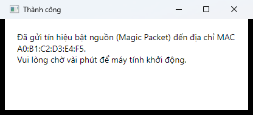
*Hình 18: Hộp thoại "Thành công" — đã gửi tín hiệu bật nguồn (Magic Packet) tới máy*

**Bước 2:** Chờ khoảng 1–2 phút để máy khởi động, quan sát chấm trạng thái trên thẻ máy chuyển xanh.

**Trường hợp lỗi — máy chưa có địa chỉ MAC:** Nếu máy chưa được điền MAC, phần mềm báo lỗi:

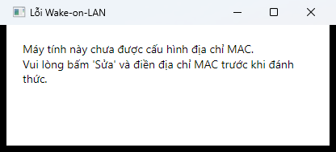
*Hình 19: Hộp thoại "Lỗi Wake-on-LAN" khi máy chưa được điền địa chỉ MAC*

**Khắc phục:** Nhấn **Sửa** trên thẻ máy → điền **Địa chỉ MAC** (dạng `XX:XX:XX:XX:XX:XX`) → **Lưu** → thử lại.

### 8.2 Kiểm tra trạng thái kết nối

Phần mềm **tự động** kiểm tra định kỳ mọi máy trong danh sách — bạn không cần bấm gì:

- Chấm **SSH** và **Remote** trên từng thẻ máy đổi màu theo kết quả kiểm tra (ý nghĩa màu: mục 3.2.2).
- Máy online hiển thị thêm CPU / RAM / Ổ cứng ngay trên thẻ.
- Các nút thao tác tự bật/tắt theo trạng thái — nút mờ nghĩa là chức năng đó chưa sẵn sàng với máy này.

> **Lưu ý:** Sau khi máy ZCU vừa khởi động hoặc vừa sửa thông tin, có thể mất một chu kỳ kiểm tra (vài chục giây) để trạng thái cập nhật. Di chuột lên chấm trạng thái để xem chú giải chi tiết.

---

## 9. Triển khai & cài đặt từ xa ⚙️ nâng cao
*(dành cho Kỹ thuật viên)*

### 9.1 Trình hướng dẫn cài Remote Agent từ xa

**Mục đích:** Cài đặt ZcuAgent lên máy ZCU hoàn toàn từ xa qua SSH — tự động cài thư viện phụ thuộc, cấu hình dịch vụ chạy nền và tường lửa. Đây là **cách cài khuyến nghị** (xem thêm chương 12).

**Cách mở:** Màn hình chính → nhấn **⚡ Cài remote** trên thẻ máy (cần chấm **SSH** xanh — thông tin SSH lấy từ hồ sơ máy, vào **Sửa** để thay đổi).

> ⏳ **[CHỜ ẢNH: `zcu-setup-wizard-default.png`]** — Chụp cửa sổ Cài đặt Remote Agent vừa mở: khung "Đang cài đặt cho: <máy>", cổng 17600, FPS 15, JPEG 70, ô AllowedIPs. Cần SSH.

**Các bước thực hiện:**

**Bước 1:** Kiểm tra khung 🎯 hiển thị đúng máy đích.

**Bước 2:** Giữ hoặc chỉnh các tham số trong khung **1️⃣ Cấu hình tham số Remote Agent**:

| Tham số | Mặc định | Ý nghĩa |
|---|---|---|
| **Cổng TCP Agent** | `17600` | Cổng ZcuAgent lắng nghe |
| **Token Bảo mật (Shared Secret)** | (trống) | Mã bảo mật — nhập tay hoặc nhấn **🎲 Sinh Token** để tạo ngẫu nhiên |
| **Mạng/IP Cho Phép Kết Nối (AllowedClientIPs)** | `0.0.0.0/0` | Dải IP được phép kết nối tới agent |
| **FPS (5-30)** | `15` | Số khung hình/giây khi truyền màn hình |
| **Chất lượng JPEG (%)** | `70` | Chất lượng nén hình ảnh |

> ⚠️ **Cảnh báo:** Giá trị `0.0.0.0/0` cho phép **mọi máy** trong mạng kết nối nếu biết Token. Nên thu hẹp thành dải mạng của bạn, ví dụ `192.168.1.0/24`.

**Bước 3:** Nhấn **🎲 Sinh Token** nếu chưa có Token — ô Token được điền mã ngẫu nhiên. **Ghi lại Token này** để nhập vào thông tin máy (mục 4.1).

> ⏳ **[CHỜ ẢNH: `zcu-setup-wizard-token-generated.png`]** — Chụp sau khi bấm 🎲 Sinh Token: ô Token có giá trị (che một phần). Cần SSH.

**Bước 4:** Giữ ô tick **"Tự động lưu máy tính này vào danh sách quản lý sau khi cài đặt thành công"** (mặc định bật) nếu muốn phần mềm tự cập nhật danh sách.

**Bước 5:** Nhấn **🚀 Bắt đầu Cài đặt**.

**Kết quả mong đợi:** Thanh tiến trình chạy, khung **💻 Nhật ký Cài đặt (Console Output)** hiện log từng bước:

> ⏳ **[CHỜ ẢNH: `zcu-setup-wizard-installing.png`]** — Chụp thanh tiến trình + log console đang chạy sau khi bấm Bắt đầu Cài đặt. Cần SSH + xác nhận của người phụ trách (cài thật sẽ ghi đè agent hiện có trên ZCU).

Khi hoàn tất, tiến trình đạt 100% và log báo cài đặt thành công:

> ⏳ **[CHỜ ẢNH: `zcu-setup-wizard-success.png`]** — Chụp trạng thái hoàn tất: log kết thúc, tiến trình 100%. Cần SSH + xác nhận cài thật.

**Trường hợp lỗi:** Sai mật khẩu SSH hoặc không tới được máy → thông báo lỗi đỏ ở thanh trạng thái dưới cùng. Kiểm tra lại thông tin SSH trong hồ sơ máy (nút **Sửa**) rồi thử lại.

> ⏳ **[CHỜ ẢNH: `zcu-setup-wizard-error.png`]** — Chụp thông báo lỗi tiêu biểu (SSH sai mật khẩu / host không tới được) — tạo bằng hồ sơ máy có SSH sai. Cần dữ liệu mẫu.

### 9.2 Cài ứng dụng lên máy ZCU từ xa

**Mục đích:** Tải lên và cài đặt gói phần mềm (`.deb`, `.sh`, `.run`) lên máy ZCU, hoặc gỡ một phần mềm đã cài — không cần thao tác trực tiếp trên máy đích.

**Cách mở:** Màn hình chính → nhấn **📦 Cài App** trên thẻ máy (cần chấm **SSH** xanh).

> ⏳ **[CHỜ ẢNH: `remote-app-install-default.png`]** — Chụp cửa sổ Cài đặt phần mềm từ xa vừa mở: khung máy đích, ô sudo, ô chọn file, ô gỡ package. Cần SSH.

**Cài đặt phần mềm:**

**Bước 1 (nếu cần):** Gõ mật khẩu sudo — để trống nếu giống mật khẩu SSH.

**Bước 2:** Nhấn **Duyệt File...** và chọn gói cài đặt (`.deb`, `.sh` hoặc `.run`) trên máy của bạn.

> ⏳ **[CHỜ ẢNH: `remote-app-install-file-selected.png`]** — Chụp sau khi Duyệt File... đã chọn 1 file .deb mẫu, đường dẫn hiện trong ô. Cần file .deb vô hại.

**Bước 3:** Nhấn **🚀 Bắt đầu Cài đặt**.

**Kết quả mong đợi:** Khung **💻 Nhật ký cài đặt (Console Output)** hiện tiến trình tải lên và cài đặt; kết thúc bằng thông báo thành công:

> ⏳ **[CHỜ ẢNH: `remote-app-install-output.png`]** — Chụp log console sau khi cài xong một gói .deb vô hại. Cần SSH + dữ liệu mẫu.

**Gỡ phần mềm:**

**Bước 1:** Gõ tên gói vào ô **Gỡ cài đặt** (gõ để tìm), hoặc nhấn **▼** để mở danh sách các gói đã cài trên máy đích.

**Bước 2:** Nhấn **🗑️ Gỡ ứng dụng**.

> ⏳ **[CHỜ ẢNH: `remote-app-install-uninstall.png`]** — Chụp danh sách gợi ý package đang mở (bấm ▼) hoặc log sau khi gỡ gói vô hại vừa cài. Cần SSH + dữ liệu mẫu.

**Trường hợp lỗi:** Thông báo lỗi màu cam ở thanh trạng thái dưới cùng (sai SSH, gói không hợp lệ...).

> ⏳ **[CHỜ ẢNH: `remote-app-install-error.png`]** — Chụp thông báo lỗi tiêu biểu ở thanh trạng thái — tạo bằng hồ sơ SSH sai. Cần dữ liệu mẫu.

> ⚠️ **Cảnh báo:** Chỉ cài gói phần mềm có nguồn gốc tin cậy (do KZTEK hoặc đơn vị quản lý cung cấp). Gỡ nhầm gói hệ thống có thể làm máy ZCU ngừng hoạt động.

### 9.3 Triển khai chế độ Kiosk

**Mục đích:** Cấu hình máy ZCU thành máy trình chiếu chuyên dụng (kiosk) hoàn toàn từ xa: ẩn các thành phần giao diện Ubuntu, tự đăng nhập, tự mở phần mềm khi khởi động — không cần cài thêm công cụ nào khác.

**Cách mở:** Màn hình chính → nhấn **🖥️ Setup** trên thẻ máy (cần chấm **SSH** xanh).

Cửa sổ "Deploy Kiosk Setup" gồm: khung máy đích, ô **Sudo password** (để trống nếu giống mật khẩu SSH), 2 tab cấu hình, khung nhật ký và nút **🚀 Deploy**.

#### Tab "🖥️ Config máy tính"

> ⏳ **[CHỜ ẢNH: `kiosk-deploy-tab-computer.png`]** — Chụp tab Config máy tính: ô Kiosk user + 2 cột ô tick (ẩn giao diện GNOME / hành vi máy). Cần SSH.

- **Kiosk user (autologin):** tài khoản trên máy ZCU sẽ được tự đăng nhập.
- **Cột ① Ẩn giao diện GNOME:** Ẩn Top Bar, Ẩn nút Activities, Ẩn Workspace Switcher, Ẩn Dash, Tắt Ubuntu Dock + Desktop Icons.
- **Cột ② Hành vi máy / màn hình:** Cài unclutter (tự ẩn con trỏ chuột), Tắt bàn phím ảo, Tắt hot corner / thông báo / khóa màn hình, Chặn ngủ khi cắm điện, Bỏ qua màn hình thiết lập ban đầu, Autologin, Khóa còn 1 workspace tĩnh.

> **Lưu ý:** Mỗi ô tick là công tắc **2 chiều**: tick = ẩn/tắt, bỏ tick = hiện lại/bật lại như mặc định (không phải "bỏ qua"). Riêng "Cài unclutter" chỉ 1 chiều — bỏ tick không tự gỡ phần đã cài. Di chuột lên dấu **❓** cạnh từng dòng để xem giải thích chi tiết.

#### Tab "⚙️ Config phần mềm"

> ⏳ **[CHỜ ẢNH: `kiosk-deploy-tab-software.png`]** — Chụp tab Config phần mềm: ô App exec + 2 ô tick update/autostart. Cần SSH.

- **App exec:** lệnh mở phần mềm kiosk khi máy khởi động.
- **Tắt popup + auto-download Software Updater:** chặn trình cập nhật hệ điều hành hiện thông báo che màn hình kiosk.
- **Autostart app + unclutter khi vào desktop:** tự mở phần mềm ngay khi máy vào màn hình chính.

#### Thực hiện Deploy

**Bước 1:** Kiểm tra kỹ các lựa chọn ở cả 2 tab.

**Bước 2:** Nhấn **🚀 Deploy**.

**Kết quả mong đợi:** Khung **💻 Nhật ký Deploy (Console Output)** hiện log từng bước cấu hình cho tới khi hoàn tất:

> ⏳ **[CHỜ ẢNH: `kiosk-deploy-log.png`]** — Chụp log console sau khi Deploy. Cần SSH + **xác nhận của người phụ trách** (Deploy thật SẼ THAY ĐỔI cấu hình giao diện GNOME/autologin của máy ZCU).

**Trường hợp lỗi:** Thông báo lỗi màu cam ở thanh trạng thái (thường do SSH sai hoặc mất kết nối).

> ⏳ **[CHỜ ẢNH: `kiosk-deploy-error.png`]** — Chụp thông báo lỗi tiêu biểu (SSH fail) — tạo bằng hồ sơ SSH sai. Cần dữ liệu mẫu.

> ⚠️ **Cảnh báo:** Deploy thay đổi cấu hình hệ điều hành của máy ZCU (giao diện, tự đăng nhập, tự mở phần mềm). Chỉ thực hiện khi được phân công và đã thống nhất cấu hình với đơn vị quản lý. Muốn hoàn tác, bỏ tick các mục tương ứng rồi Deploy lại.

---

## 10. Bản quyền phần mềm

### 10.1 Nhập & kích hoạt bản quyền

**Mục đích:** Kích hoạt bản quyền phần mềm CCU bằng mã do KZTEK cấp, gắn với mã thiết bị (Hardware ID) của máy.

**Cách mở:** Cửa sổ kích hoạt bản quyền do KZTEK kích hoạt kèm theo bản phát hành khi có yêu cầu quản lý bản quyền — trong bản phần mềm hiện tại, cửa sổ này không có nút mở từ giao diện chính. Liên hệ KZTEK (chương 15) nếu bạn cần kích hoạt bản quyền.

> ⏳ **[CHỜ ẢNH: `license-default.png`]** — Chụp cửa sổ Kích hoạt bản quyền: ô Hardware ID hiển thị sẵn (che một phần), ô nhập key trống. Cần công cụ hỗ trợ mở cửa sổ (harness) — quyết định ở bước chụp bổ sung.

**Các bước thực hiện:**

**Bước 1:** Nhấn **📋 Copy** cạnh ô **Mã thiết bị (Hardware ID)** để sao chép mã thiết bị.

**Bước 2:** Gửi Hardware ID cho KZTEK để nhận mã kích hoạt (License Key).

**Bước 3:** Dán mã nhận được vào ô **Nhập mã kích hoạt (License Key)**.

**Bước 4:** Nhấn **Kích hoạt**.

**Kết quả thành công:** Thông báo màu xanh "Kích hoạt thành công! Ứng dụng sẽ khởi động lại..." — chờ phần mềm tự mở lại.

> ⏳ **[CHỜ ẢNH: `license-success.png`]** — Chụp thông báo kích hoạt thành công (xanh). Cần harness + License Key hợp lệ do công cụ nội bộ KZTEK ký — **ứng viên BLOCK**, nếu không tạo được key hợp lệ thì giữ mô tả chữ.

**Trường hợp lỗi:**

- Bỏ trống ô mã rồi bấm **Kích hoạt** → thông báo đỏ "Vui lòng nhập License Key."

> ⏳ **[CHỜ ẢNH: `license-error-empty.png`]** — Chụp thông báo đỏ khi bấm Kích hoạt lúc ô mã còn trống. Cần harness.

- Mã sai hoặc không khớp thiết bị → thông báo đỏ báo mã không hợp lệ.

> ⏳ **[CHỜ ẢNH: `license-error-invalid.png`]** — Chụp thông báo đỏ khi nhập key sai. Cần harness.

### 10.2 Câu hỏi khi bản quyền không hợp lệ

**Q: Nhập mã nhưng luôn báo không hợp lệ?**
A: Mã kích hoạt gắn với đúng một Hardware ID. Kiểm tra: (1) mã được cấp cho đúng máy này chưa (so lại Hardware ID đã gửi), (2) đã dán đủ toàn bộ mã, không thiếu ký tự đầu/cuối. Nếu vẫn lỗi, gửi lại Hardware ID cho KZTEK để cấp mã mới.

**Q: Đổi máy tính / cài lại Windows thì mã cũ còn dùng được không?**
A: Không — Hardware ID thay đổi theo máy. Liên hệ KZTEK để được cấp mã mới theo Hardware ID mới.

---

# PHẦN 2 — TRIỂN KHAI ZCU
*(dành cho Kỹ thuật viên)*

---

## 11. Chuẩn bị máy ZCU trước khi cài đặt

Chương này liệt kê những việc **bắt buộc kiểm tra** trên máy ZCU trước khi cài ZcuAgent. Bỏ qua bất kỳ mục nào cũng có thể khiến agent cài xong nhưng không chạy được.

### 11.1 Yêu cầu phần cứng & hệ điều hành

| Thành phần | Yêu cầu |
|---|---|
| Hệ điều hành | Ubuntu 22.04 (bản Desktop — cần môi trường đồ họa để truyền màn hình) |
| Phiên làm việc | **X11 (Ubuntu on Xorg)** — ZcuAgent không hoạt động trên Wayland |
| Tài khoản | Một tài khoản người dùng có quyền `sudo` (dùng để cài thư viện, mở tường lửa) |
| Mạng | Cắm cùng mạng LAN với máy CCU, có địa chỉ IP cố định hoặc DHCP reservation (khuyến nghị) |
| Dung lượng trống | ≥ 500 MB (cho .NET 8 Runtime + agent) |

> **Lưu ý:** Nên đặt IP tĩnh (hoặc gán IP cố định trên router) cho máy ZCU — nếu IP đổi sau mỗi lần khởi động, hồ sơ máy trên CCU sẽ sai địa chỉ và báo trạng thái đỏ.

### 11.2 Kiểm tra và chuyển phiên làm việc sang X11

ZcuAgent chụp màn hình và bơm chuột/bàn phím qua giao thức X11 (XShm/XTest). Khi khởi động, agent **tự kiểm tra biến môi trường `XDG_SESSION_TYPE` và từ chối chạy** nếu không phải `x11` — đây là hành vi có chủ đích, không phải lỗi.

**Bước 1:** Mở Terminal trên máy ZCU, kiểm tra loại phiên hiện tại:

```bash
echo $XDG_SESSION_TYPE
```

- Kết quả `x11` → đạt yêu cầu, sang mục 11.3.
- Kết quả `wayland` → làm tiếp Bước 2.

> ⏳ **[CHỜ ẢNH: `zcu-terminal-session-x11.png`]** — Chụp terminal ZCU chạy `echo $XDG_SESSION_TYPE` cho kết quả `x11`.

**Bước 2 (nếu đang là Wayland):** Đăng xuất khỏi phiên hiện tại. Tại màn hình đăng nhập, nhấp biểu tượng **bánh răng** (góc dưới bên phải, hiện sau khi chọn tên người dùng) và chọn **"Ubuntu on Xorg"**, rồi đăng nhập lại.

**Bước 3:** Chạy lại lệnh ở Bước 1 để xác nhận kết quả đã là `x11`.

### 11.3 Cài đặt & bật SSH server

SSH không bắt buộc để agent chạy, nhưng **bắt buộc** nếu muốn dùng: cài agent từ xa (mục 9.1), Quản lý File, chạy lệnh, giám sát, cài app và Kiosk từ CCU. Khuyến nghị luôn cài.

```bash
sudo apt update                     # cập nhật danh sách gói
sudo apt install -y openssh-server  # cài SSH server
sudo systemctl enable --now ssh     # bật ngay và tự chạy khi khởi động
systemctl status ssh                # kiểm tra: phải thấy "active (running)"
```

> ⏳ **[CHỜ ẢNH: `zcu-terminal-ssh-install.png`]** — Chụp terminal ZCU sau khi cài openssh-server: `systemctl status ssh` hiển thị `active (running)`.

### 11.4 Kiểm tra kết nối mạng giữa CCU và ZCU

Thực hiện từ **máy CCU** (Windows, mở Command Prompt):

```powershell
ping 192.168.1.x        # thay bằng IP máy ZCU — phải có phản hồi (Reply)
```

Sau khi cài SSH (mục 11.3), kiểm tra thêm cổng 22 từ máy CCU:

```powershell
Test-NetConnection 192.168.1.x -Port 22   # PowerShell — TcpTestSucceeded : True
```

Nếu ping không thông: kiểm tra hai máy có cùng dải mạng không, dây mạng/Wi-Fi của ZCU, và tường lửa giữa hai máy (cần mở cổng **22** và **17600** theo chiều CCU → ZCU, xem mục 2.3).

### 11.5 Checklist trước khi cài

- [ ] Ubuntu 22.04, phiên đăng nhập là **Ubuntu on Xorg** (`XDG_SESSION_TYPE` = `x11`)
- [ ] Có tài khoản với quyền `sudo`, biết mật khẩu
- [ ] `openssh-server` đang chạy (`systemctl status ssh` → active)
- [ ] Máy CCU ping được IP máy ZCU
- [ ] Đã ghi lại: IP máy ZCU, tên người dùng, mật khẩu — để nhập vào hồ sơ máy trên CCU (mục 4.1)

---

## 12. Cài đặt ZcuAgent

Có **2 cách cài** ZcuAgent. Cách 1 làm hoàn toàn từ máy CCU, không cần gõ lệnh trên máy ZCU — dùng khi SSH đã sẵn sàng (chương 11). Cách 2 thao tác trực tiếp trên máy ZCU — dùng khi chưa có SSH hoặc cần chủ động kiểm soát từng bước.

> **Lưu ý:** Gói `.deb` nhắc đến ở mục 9.2 là gói **phần mềm ứng dụng** (ví dụ IPGSUseCam) cài lên máy ZCU — không phải gói cài ZcuAgent. ZcuAgent được triển khai bằng 2 cách dưới đây.

### 12.1 Cách 1 — Cài từ xa bằng phần mềm CCU (khuyến nghị)

Toàn bộ thao tác màn hình đã mô tả chi tiết tại **mục 9.1** (nút **⚡ Cài remote** → Trình hướng dẫn cài Remote Agent). Về mặt kỹ thuật, trình hướng dẫn tự động làm trên máy ZCU qua SSH đúng những việc sau (để kỹ thuật viên biết chuyện gì xảy ra):

1. Cài các thư viện X11 cần thiết: `libx11-6`, `libxext6`, `libxtst6` (qua `apt-get`, cần mật khẩu sudo).
2. Cài .NET 8 Runtime vào `~/.dotnet` nếu máy chưa có.
3. Tải file thực thi `IPGS.RemoteControl.ZcuAgent` lên thư mục `~/ipgs/remote-agent/`.
4. Ghi file cấu hình `~/ipgs/remote-agent/appsettings.json` theo tham số đã nhập trên wizard (cổng, Token, AllowedClientIPs, FPS, JPEG).
5. Tạo **systemd user service** `ipgs-remote-agent.service`, bật `enable` + `loginctl enable-linger` để agent tự chạy cùng máy.
6. Khởi động service và kiểm tra trạng thái `active`.

Sau khi wizard báo hoàn tất, kiểm tra lại theo mục 12.5.

### 12.2 Cách 2 — Cài thủ công bằng script `setup-zcu-agent.sh`

Thực hiện trực tiếp trên máy ZCU (hoặc qua một phiên SSH tự mở).

**Bước 1:** Chép 2 thứ sang máy ZCU (bằng USB hoặc `scp`): script `setup-zcu-agent.sh` và file thực thi `IPGS.RemoteControl.ZcuAgent` (bản publish `linux-x64` do KZTEK cung cấp kèm bản phát hành).

```bash
# Ví dụ chép bằng scp từ một máy khác trong mạng:
scp setup-zcu-agent.sh IPGS.RemoteControl.ZcuAgent <tên người dùng>@192.168.1.x:~/
```

**Bước 2:** Trên máy ZCU, chạy script với các tham số theo thứ tự `[CỔNG] [TOKEN] [ALLOWED_IPS] [FPS] [JPEG]` — tham số nào bỏ trống sẽ dùng mặc định:

```bash
chmod +x ~/setup-zcu-agent.sh          # cấp quyền thực thi cho script
~/setup-zcu-agent.sh 17600 "<mã kết nối>" 192.168.1.0/24 15 70
```

| Tham số | Mặc định nếu bỏ trống | Ý nghĩa |
|---|---|---|
| CỔNG | `17600` | Cổng TCP agent lắng nghe |
| TOKEN | Sinh ngẫu nhiên bằng `openssl rand -hex 16` | Mã bảo mật — **ghi lại giá trị hiển thị cuối script** để nhập vào CCU |
| ALLOWED_IPS | `0.0.0.0/0` (mọi IP) | Dải IP được phép kết nối — nên thu hẹp, ví dụ `192.168.1.0/24` |
| FPS | `15` | Số khung hình/giây |
| JPEG | `70` | Chất lượng nén ảnh (%) |

Script lần lượt: cảnh báo nếu phiên là Wayland → cài thư viện X11 → cài .NET 8 Runtime (nếu thiếu) → ghi `appsettings.json` → tạo + enable service `ipgs-remote-agent.service` → mở cổng trên tường lửa UFW → tắt tự khóa màn hình GNOME (tránh màn hình đen khi remote). Trong quá trình chạy, script hỏi mật khẩu `sudo` khi cần.

> ⏳ **[CHỜ ẢNH: `zcu-terminal-setup-script.png`]** — Chụp terminal ZCU đang chạy `setup-zcu-agent.sh`: các dòng bước [1/7]–[7/7] và khối "HOÀN THÀNH CÀI ĐẶT" cuối script (che giá trị Token).

**Bước 3:** Chép file thực thi vào thư mục cài đặt và khởi động service (script đã tự làm nếu file có sẵn từ trước; nếu script báo "File ... chưa có" thì làm tay):

```bash
mkdir -p ~/ipgs/remote-agent
cp ~/IPGS.RemoteControl.ZcuAgent ~/ipgs/remote-agent/     # chép binary vào thư mục cài đặt
chmod +x ~/ipgs/remote-agent/IPGS.RemoteControl.ZcuAgent  # cấp quyền thực thi
systemctl --user start ipgs-remote-agent.service           # khởi động agent
```

**Bước 4:** Kiểm tra theo mục 12.5, rồi khai báo máy vào CCU (mục 4.1) với đúng IP + cổng + Token vừa cài.

### 12.3 Vị trí file sau khi cài

| Thành phần | Đường dẫn trên máy ZCU |
|---|---|
| File thực thi agent | `~/ipgs/remote-agent/IPGS.RemoteControl.ZcuAgent` |
| File cấu hình | `~/ipgs/remote-agent/appsettings.json` |
| Unit file systemd (user service) | `~/.config/systemd/user/ipgs-remote-agent.service` |
| .NET Runtime (nếu cài bởi script/wizard) | `~/.dotnet/` |
| Log | systemd journal (xem `journalctl`, mục 12.5) — agent không ghi file log riêng |

*(`~` là thư mục nhà của tài khoản đã dùng để cài, ví dụ `/home/<tên người dùng>`.)*

### 12.4 Cấu hình `appsettings.json`

File `~/ipgs/remote-agent/appsettings.json` do trình cài đặt **tự sinh** theo tham số bạn nhập — bình thường không cần sửa tay. Cấu trúc (khối `RemoteControl`):

```json
{
  "RemoteControl": {
    "Port": 17600,
    "Token": "<mã kết nối>",
    "AllowedClientIPs": [ "192.168.1.0/24" ],
    "TargetFps": 15,
    "JpegQuality": 70,
    "MaxFrameBytes": 8388608
  }
}
```

| Khóa | Ý nghĩa | Ghi chú |
|---|---|---|
| `Port` | Cổng TCP agent lắng nghe | Mặc định 17600. **Giá trị thực tế là giá trị trình cài đặt đã ghi vào file này** — nếu tài liệu/bản mẫu nào đó ghi cổng khác (ví dụ bản cấu hình mẫu cũ dùng 5900), hãy lấy nội dung file trên máy làm chuẩn |
| `Token` | Mã bảo mật dùng chung với CCU | Bắt buộc — agent từ chối kết nối sai Token. Không gửi Token qua kênh không an toàn |
| `AllowedClientIPs` | Danh sách IP/dải CIDR được phép kết nối | **Danh sách rỗng = chặn tất cả** (mặc định an toàn). `0.0.0.0/0` = cho phép mọi IP — agent chấp nhận nhưng ghi cảnh báo lúc khởi động |
| `EnableDesktopIntegration` | Cho phép chat notification (`notify-send`) và đồng bộ clipboard (`xclip`) | Mặc định `true`; đặt `false` nếu muốn cấm agent gọi tiến trình ngoài |
| `TargetFps` | Khung hình/giây (5–30) | Giảm nếu mạng yếu |
| `JpegQuality` | Chất lượng nén (40–95) | Giảm nếu mạng yếu |
| `MaxFrameBytes` | Giới hạn kích thước 1 khung hình | Giữ mặc định 8388608 (8 MB) |

Xem nhanh cấu hình hiện tại trên máy:

```bash
cat ~/ipgs/remote-agent/appsettings.json
```

> ⏳ **[CHỜ ẢNH: `zcu-terminal-appsettings.png`]** — Chụp terminal ZCU chạy `cat ~/ipgs/remote-agent/appsettings.json` (che giá trị Token).

> ⚠️ **Cảnh báo:** Sau khi sửa tay `appsettings.json`, phải khởi động lại service (mục 12.5) thì thay đổi mới có hiệu lực. Nếu đổi `Port` hoặc `Token`, nhớ cập nhật lại hồ sơ máy trên CCU (mục 4.1) và tường lửa (`sudo ufw allow <cổng mới>/tcp`).

### 12.5 Quản lý dịch vụ systemd

ZcuAgent chạy dưới dạng **systemd user service** (gắn với tài khoản đã cài, không phải service hệ thống) — vì agent cần truy cập màn hình X11 của phiên đăng nhập. Các lệnh dưới đây chạy bằng chính tài khoản đó, **không dùng `sudo`**:

```bash
systemctl --user status  ipgs-remote-agent.service   # xem trạng thái — cần "active (running)"
systemctl --user restart ipgs-remote-agent.service   # khởi động lại (sau khi đổi cấu hình)
systemctl --user stop    ipgs-remote-agent.service   # dừng tạm
systemctl --user start   ipgs-remote-agent.service   # chạy lại
systemctl --user enable  ipgs-remote-agent.service   # tự chạy khi đăng nhập (trình cài đã bật sẵn)
systemctl --user disable ipgs-remote-agent.service   # bỏ tự chạy
```

> ⏳ **[CHỜ ẢNH: `zcu-terminal-service-status.png`]** — Chụp `systemctl --user status ipgs-remote-agent.service` với trạng thái `active (running)`, thấy dòng Loaded/Active và vài dòng log cuối.

**Xem log của agent** (log ghi vào systemd journal):

```bash
journalctl --user -u ipgs-remote-agent.service -e     # nhảy tới log mới nhất
journalctl --user -u ipgs-remote-agent.service -f     # theo dõi log thời gian thực (Ctrl+C để thoát)
journalctl --user -u ipgs-remote-agent.service --since "1 hour ago"   # log 1 giờ gần nhất
```

> ⏳ **[CHỜ ẢNH: `zcu-terminal-journalctl.png`]** — Chụp `journalctl --user -u ipgs-remote-agent.service -e` hiển thị các dòng log khởi động của agent.

**Để agent chạy cả khi chưa ai đăng nhập terminal:** trình cài đã bật *lingering* cho tài khoản (`sudo loginctl enable-linger <tên người dùng>`). Tuy nhiên phần truyền màn hình chỉ hoạt động khi phiên đồ họa X11 đang mở — với máy trạm không người trực, kết hợp **Autologin** (thiết lập được qua Kiosk Deploy, mục 9.3) để máy tự vào màn hình chính sau khi khởi động.

### 12.6 Kiểm tra sau cài đặt

Theo thứ tự từ máy ZCU ra tới máy CCU:

**1. Service đang chạy?** — `systemctl --user status ipgs-remote-agent.service` → `active (running)`.

**2. Agent đang lắng nghe đúng cổng?**

```bash
ss -tlnp | grep 17600      # phải thấy một dòng LISTEN trên cổng 17600
```

**3. Tường lửa đã mở cổng?**

```bash
sudo ufw status            # nếu UFW đang bật, phải có luật ALLOW cho 17600/tcp
```

> ⏳ **[CHỜ ẢNH: `zcu-terminal-ufw-status.png`]** — Chụp `sudo ufw status` có luật `17600/tcp ALLOW` (comment "IPGS Remote Control Agent").

**4. Từ máy CCU:** mở phần mềm CCU → chấm **Remote** của máy chuyển xanh (mục 3.2.2) → nhấn **Kết nối** thấy màn hình ZCU. Hoặc dùng **🔍 Quét mạng** (mục 4.2) — máy phải xuất hiện trong kết quả quét.

**Nếu chưa được:** xem FAQ mục 14.1.

### 12.7 Gỡ cài đặt / Nâng cấp

**Gỡ cài đặt** (chạy trên máy ZCU bằng tài khoản đã cài):

```bash
systemctl --user stop ipgs-remote-agent.service       # dừng agent
systemctl --user disable ipgs-remote-agent.service    # bỏ tự chạy
rm ~/.config/systemd/user/ipgs-remote-agent.service   # xóa unit file
systemctl --user daemon-reload                        # nạp lại cấu hình systemd
rm -rf ~/ipgs/remote-agent                            # xóa thư mục cài đặt (binary + cấu hình)
sudo ufw delete allow 17600/tcp                       # (tùy chọn) đóng cổng trên tường lửa
```

**Nâng cấp phiên bản:** chạy lại trình cài (Cách 1 mục 9.1 hoặc Cách 2 mục 12.2) — trình cài tự dừng service cũ, ghi đè binary và khởi động lại. Cấu hình sẽ được ghi lại theo tham số nhập lần này, vì vậy **nhập lại đúng Token/cổng đang dùng** nếu không muốn phải cập nhật lại hồ sơ máy trên CCU.

---

## 13. Khóa & bảo mật hệ thống

### 13.1 Khóa SSH

Kênh SSH là "chìa khóa quản trị" máy ZCU — mọi chức năng file/lệnh/cài đặt từ CCU đều đi qua đây. Phần mềm CCU đăng nhập SSH bằng **tên người dùng + mật khẩu** lưu trong hồ sơ máy (mục 4.1), vì vậy tối thiểu phải:

- Dùng mật khẩu mạnh cho tài khoản trên máy ZCU (không dùng mật khẩu mặc định/dễ đoán).
- Chỉ những người được phân công mới biết mật khẩu; đổi mật khẩu khi nhân sự thay đổi (`passwd` trên máy ZCU, sau đó cập nhật hồ sơ máy trên CCU).

**Dùng thêm khóa SSH (khuyến nghị cho kỹ thuật viên):** khi cần truy cập SSH thủ công (ngoài phần mềm CCU), nên xác thực bằng cặp khóa thay vì mật khẩu. Trên máy của kỹ thuật viên:

```bash
ssh-keygen -t ed25519 -C "kythuat@kztek"        # sinh cặp khóa (Enter để nhận mặc định, nên đặt passphrase)
ssh-copy-id <tên người dùng>@192.168.1.x         # cài khóa công khai lên máy ZCU (nhập mật khẩu lần cuối)
ssh <tên người dùng>@192.168.1.x                 # từ nay đăng nhập không cần mật khẩu
```

> ⏳ **[CHỜ ẢNH: `zcu-terminal-ssh-keygen.png`]** — Chụp terminal chạy `ssh-keygen -t ed25519` và `ssh-copy-id` thành công tới máy ZCU (che fingerprint nếu cần).

> ⚠️ **Cảnh báo:** Không tắt xác thực mật khẩu SSH (`PasswordAuthentication no`) trên máy ZCU khi hệ thống vẫn dùng phần mềm CCU để quản trị — phiên bản hiện tại của phần mềm CCU đăng nhập SSH bằng mật khẩu, tắt đi sẽ làm mọi nút quản trị (📁, >_, ⚡ Cài remote...) ngừng hoạt động.

### 13.2 Token ZcuAgent

Token là mã bí mật dùng chung: CCU gửi Token khi kết nối, agent đối chiếu với giá trị trong `appsettings.json` — sai là từ chối. Quy tắc quản lý:

- **Sinh ngẫu nhiên, đủ dài:** dùng nút **🎲 Sinh Token** trên wizard (mục 9.1) hoặc `openssl rand -hex 16` — không tự nghĩ chuỗi ngắn dễ đoán.
- **Mỗi máy một Token riêng** — lộ một máy không ảnh hưởng máy khác.
- **Lưu trữ:** Token nằm trong `appsettings.json` trên máy ZCU và trong hồ sơ máy trên CCU. Không gửi Token qua chat/email không mã hóa.
- **Đổi Token định kỳ hoặc khi nghi lộ:** sửa `Token` trong `appsettings.json` (hoặc chạy lại trình cài với Token mới) → `systemctl --user restart ipgs-remote-agent.service` → cập nhật hồ sơ máy trên CCU (nút **Sửa**).

### 13.3 Sinh cặp khóa bản quyền bằng công cụ KeyGen ⚙️ nội bộ KZTEK

*(Mục này dành riêng cho bộ phận phát hành của KZTEK — kỹ thuật viên hiện trường không cần thực hiện.)*

Cơ chế bản quyền dùng chữ ký số RSA 2048: **khóa công khai** nhúng sẵn trong phần mềm CCU để kiểm tra chữ ký; **khóa bí mật** do KZTEK giữ, dùng để ký mã kích hoạt cấp cho khách.

Công cụ `KeyGen` (project console trong bộ mã nguồn) sinh cặp khóa:

```bash
cd KeyGen
dotnet run          # in ra "Public Key:" và "Private Key (Keep Secret):" dạng XML
```

> ⏳ **[CHỜ ẢNH: `keygen-output.png`]** — Chụp console KeyGen in ra hai khối Public Key / Private Key (che gần hết nội dung khóa, chỉ giữ vài ký tự đầu để minh họa).

- **Public Key:** nhúng vào mã nguồn phần mềm CCU (thay giá trị trong `LicenseManagerService`) rồi build lại bản phát hành.
- **Private Key:** lưu trữ tuyệt mật tại KZTEK (không đưa vào mã nguồn, không gửi qua mạng) — dùng cho công cụ ký license nội bộ.

> ⚠️ **Cảnh báo:** Sinh cặp khóa mới đồng nghĩa **mọi mã kích hoạt đã cấp bằng khóa cũ trở nên không hợp lệ** với bản phần mềm nhúng khóa mới. Chỉ thay khóa khi có chủ trương, và quản lý phiên bản khóa ↔ phiên bản phần mềm cẩn thận.

### 13.4 Quy trình cấp & kích hoạt bản quyền

Thao tác kích hoạt trên máy CCU đã mô tả tại **mục 10.1**. Quy trình đầy đủ hai phía:

1. Khách/kỹ thuật viên lấy **Hardware ID** trên cửa sổ kích hoạt của máy CCU (mã sinh từ địa chỉ phần cứng mạng của máy, dạng `XXXX-XXXX-XXXX-XXXX`) và gửi cho KZTEK.
2. KZTEK tạo mã kích hoạt: gói thông tin *Tên khách hàng | Hardware ID | Ngày hết hạn* và **ký bằng khóa bí mật** (mục 13.3).
3. Khách dán mã vào cửa sổ kích hoạt → phần mềm kiểm tra chữ ký bằng khóa công khai, đối chiếu Hardware ID và hạn dùng → hợp lệ thì lưu vào máy (file `license.key` trong thư mục dữ liệu ứng dụng của Windows) và báo thành công.

> **Lưu ý về hiện trạng:** Ở phiên bản phần mềm hiện tại, cơ chế bản quyền đã có đầy đủ phần kiểm tra mã, nhưng **chưa khóa chức năng khi thiếu bản quyền** — phần mềm CCU vẫn dùng được bình thường khi chưa kích hoạt, và cửa sổ kích hoạt không có nút mở từ giao diện chính (xem mục 10.1). Việc bật ràng buộc bản quyền (nếu cần) do KZTEK quyết định theo từng bản phát hành — tài liệu này không cam kết hành vi khóa ứng dụng.

### 13.5 Khuyến nghị bảo mật khi triển khai

| Hạng mục | Khuyến nghị |
|---|---|
| `AllowedClientIPs` | Thu hẹp về dải mạng thật (ví dụ `192.168.1.0/24`) hoặc chỉ đúng IP máy CCU — không để `0.0.0.0/0` khi vận hành lâu dài |
| Tường lửa (UFW) | Chỉ mở cổng 22 và cổng agent (17600); xóa các luật không dùng (`sudo ufw status numbered` → `sudo ufw delete <số>`) |
| Mật khẩu | Đổi mật khẩu mặc định của mọi tài khoản trên máy ZCU ngay khi triển khai; dùng mật khẩu khác nhau giữa các máy |
| Token | Mỗi máy một Token ngẫu nhiên; đổi khi nghi lộ (mục 13.2) |
| Mạng | Đặt các máy CCU/ZCU trong mạng LAN/VLAN nội bộ — **không** mở cổng agent ra Internet |
| Cập nhật | Cập nhật bảo mật Ubuntu định kỳ (`sudo apt update && sudo apt upgrade`) theo lịch bảo trì |

---

## 14. Câu hỏi thường gặp (FAQ)

### 14.1 FAQ triển khai ZCU

**Q: Cài xong nhưng service báo `failed` / agent không chạy?**
A: Xem lý do trong log: `journalctl --user -u ipgs-remote-agent.service -e`. Ba nguyên nhân hay gặp: (1) phiên đăng nhập là **Wayland** — agent in lỗi `XDG_SESSION_TYPE` và tự thoát, chuyển sang "Ubuntu on Xorg" (mục 11.2); (2) thiếu thư viện X11 — chạy `sudo apt install -y libx11-6 libxext6 libxtst6`; (3) file thực thi chưa có hoặc chưa có quyền chạy — kiểm tra `ls -l ~/ipgs/remote-agent/` và `chmod +x` (mục 12.2 Bước 3).

**Q: Agent đang `active (running)` nhưng CCU quét mạng/kết nối không thấy máy?**
A: Kiểm tra theo thứ tự: (1) `ss -tlnp | grep 17600` — agent có lắng nghe đúng cổng không, và cổng đó có khớp với cổng nhập trên CCU không; (2) `sudo ufw status` — tường lửa đã mở cổng chưa (`sudo ufw allow 17600/tcp` nếu thiếu); (3) từ máy CCU `ping` tới IP máy ZCU; (4) `AllowedClientIPs` trong `appsettings.json` có chứa IP/dải mạng của máy CCU không — **danh sách rỗng là chặn tất cả**; sửa xong nhớ restart service.

**Q: Kết nối bị từ chối dù mạng thông — nghi sai Token?**
A: Token hai bên phải trùng từng ký tự. So sánh giá trị `Token` trong `~/ipgs/remote-agent/appsettings.json` trên máy ZCU với ô Token trong hồ sơ máy trên CCU (nút **Sửa**). Lưu ý: nếu vừa chạy lại trình cài đặt với Token mới sinh, hồ sơ cũ trên CCU vẫn giữ Token cũ — cập nhật lại.

**Q: Máy ZCU khởi động lại xong là mất kết nối, phải vào máy bật lại agent?**
A: Kiểm tra 3 điều: (1) service đã `enable` chưa — `systemctl --user is-enabled ipgs-remote-agent.service` phải trả về `enabled`; (2) lingering đã bật chưa — `loginctl show-user <tên người dùng> | grep Linger` phải là `Linger=yes` (bật bằng `sudo loginctl enable-linger <tên người dùng>`); (3) máy có tự đăng nhập vào phiên đồ họa X11 không — agent cần phiên màn hình đang mở, thiết lập Autologin qua Kiosk Deploy (mục 9.3) cho máy không người trực.

**Q: Nghi ngờ firewall chặn cổng — kiểm tra thế nào?**
A: Trên máy ZCU: `sudo ufw status verbose` — nếu `Status: active` mà không có luật ALLOW cho cổng agent, chạy `sudo ufw allow 17600/tcp`. Kiểm tra chiều từ CCU: PowerShell `Test-NetConnection 192.168.1.x -Port 17600` — `TcpTestSucceeded : True` là thông. Đừng quên thiết bị mạng trung gian (router/switch có ACL) cũng có thể chặn.

**Q: Xem log của agent ở đâu? Có file log không?**
A: Agent không ghi file log riêng — toàn bộ log vào systemd journal. Dùng `journalctl --user -u ipgs-remote-agent.service -e` (mới nhất), thêm `-f` để theo dõi trực tiếp, hoặc `--since "1 hour ago"` để giới hạn thời gian (mục 12.5).

**Q: Kết nối được nhưng màn hình truyền về đen thui?**
A: Thường do máy ZCU đã tự khóa màn hình/tắt màn hình. Trình cài đặt đã tắt tự khóa GNOME, nhưng nếu máy cài tay hoặc ai đó bật lại: chạy `gsettings set org.gnome.desktop.screensaver lock-enabled false` và `gsettings set org.gnome.desktop.session idle-delay 0` trên máy ZCU. Cũng kiểm tra máy có đang đứng ở màn hình đăng nhập (chưa vào desktop) không — cần Autologin cho máy không người trực.

### 14.2 FAQ vận hành CCU

**Q: Nút "Kết nối" trên máy bị mờ, không bấm được?**
A: Chấm **Remote** của máy đang không xanh — ZcuAgent trên máy đích chưa chạy hoặc không tới được. Kiểm tra máy ZCU đã bật chưa; nếu máy đang bật mà vẫn đỏ, nhờ kỹ thuật viên kiểm tra ZcuAgent (Phần 2). Bạn vẫn có thể **nhấp đúp** vào thẻ máy để mở cửa sổ kết nối và quan sát phần mềm tự thử kết nối lại.

**Q: Các nút 📁 Quản lý File / >_ CMD Shell / ⚡ Cài remote bị mờ?**
A: Các chức năng này cần chấm **SSH** xanh. Kiểm tra: máy ZCU đã cài `openssh-server` chưa (câu lệnh gợi ý ngay trên dòng nhắc vàng của màn hình chính), và hồ sơ máy đã điền **Thông tin SSH** chưa (nút **Sửa** → khối 🔐).

**Q: Cửa sổ điều khiển hiện dải đỏ "Không thể kết nối sau nhiều lần thử"?**
A: Lần lượt kiểm tra: (1) máy ZCU còn bật không, (2) IP trong hồ sơ máy còn đúng không (máy có thể bị đổi IP), (3) Token hai bên có khớp không, (4) mạng LAN giữa hai máy có thông không. Sửa xong, đóng cửa sổ và kết nối lại.

**Q: Xem màn hình từ xa bị giật / chậm?**
A: Chất lượng phụ thuộc băng thông mạng và cấu hình FPS/JPEG đặt lúc cài agent (mục 9.1). Kỹ thuật viên có thể giảm FPS hoặc chất lượng JPEG để mượt hơn trên mạng yếu. Khi xem nhiều máy cùng lúc ở Multi-Remote, mỗi phiên đều tốn băng thông — đóng bớt phiên không cần thiết.

**Q: Bấm ⚡ Bật nguồn nhưng máy không lên?**
A: Kiểm tra: (1) máy đã điền đúng địa chỉ MAC chưa (mục 4.1), (2) tính năng Wake-on-LAN đã bật trong BIOS máy ZCU chưa (kỹ thuật viên thiết lập), (3) máy ZCU còn cắm điện và cắm dây mạng không — WoL không hoạt động khi rút điện.

**Q: Lỡ bấm "Xóa" nhầm một máy trong danh sách?**
A: Thao tác xóa không hỏi lại và không hoàn tác được — thêm lại máy bằng **+ Thêm máy tính** với thông tin cũ. Việc xóa không ảnh hưởng máy ZCU thật.

**Q: Máy ZCU mất điện đột ngột / hỏng phần cứng thì phần mềm báo gì?**
A: Các chấm trạng thái của máy chuyển đỏ ở chu kỳ kiểm tra kế tiếp; phiên điều khiển đang mở (nếu có) tự thử kết nối lại rồi báo lỗi đỏ. Đây là tình huống phần cứng — cần kiểm tra trực tiếp tại máy.

---

## 15. Liên hệ hỗ trợ

| Kênh | Thông tin |
|---|---|
| Email | sales@kztek.net |
| Hotline | 0988 637 099 |
| Điện thoại | 0243 99 88 033 |
| Website | kztek.net |

**CÔNG TY CỔ PHẦN ĐẦU TƯ VÀ PHÁT TRIỂN KZTEK**
VP Hà Nội: Tầng 1, Tòa nhà CT3, KĐT Dream Town, Xuân Phương, TP. Hà Nội
VP HCM: 6B11 Đường số 9, Khu phố 4, Phường An Khánh, TP. HCM

---

## Phụ lục A — Danh sách ảnh còn thiếu

> Checklist cho phiên chụp bổ sung khi máy ZCU hoạt động trở lại. Điều kiện tiên quyết: **ZCU** = cần máy ZCU `192.168.1.x` online (cổng 17600); **SSH** = cần SSH tới ZCU (cổng 22); **DATA** = cần dữ liệu mẫu (3 máy P01/P02/P03, thư mục demo trên ZCU); **Harness** = cần công cụ dev mở LicenseWindow (không có đường mở từ giao diện); **User OK** = cần người phụ trách xác nhận vì thao tác thay đổi máy ZCU thật; **ZCU-TERM** = cần thao tác trực tiếp trên terminal của máy ZCU (ngồi tại máy hoặc SSH); **DEV** = chụp trên máy phát triển có mã nguồn, không cần ZCU.

| # | Tên file | Màn hình | Trạng thái cần chụp | Điều kiện |
|---|---|---|---|---|
| 1 | `connection-entry-default.png` (chụp lại) | Màn hình chính | P01 online: chấm SSH+Remote xanh, badge CPU/RAM/Disk | ZCU + DATA |
| 2 | `network-scan-results.png` | Quét mạng | Tìm thấy ZCU thật: tên, IP, độ phân giải, nút Thêm | ZCU |
| 3 | `remote-screen-streaming.png` | Điều khiển từ xa | Đang hiển thị màn hình ZCU, chấm xanh, các nút công cụ bật | ZCU |
| 4 | `remote-screen-privacy-on.png` | Điều khiển từ xa | Toggle 🕶️ Privacy đang bật | ZCU |
| 5 | `remote-screen-record-on.png` | Điều khiển từ xa | Toggle 🔴 Record đang bật | ZCU |
| 6 | `remote-screen-chat.png` | Điều khiển từ xa | Đã gõ + gửi tin nhắn chat | ZCU |
| 7 | `remote-screen-clipboard-sync.png` | Điều khiển từ xa | Sau khi bấm 📋 Sync Clipboard (best-effort) | ZCU |
| 8 | `remote-screen-disconnected.png` | Điều khiển từ xa | Sau khi Ngắt kết nối — nút mờ đi | ZCU |
| 9 | `multi-remote-grid-2x2.png` | Multi-Remote | Lưới 2x2 có phiên live | ZCU + DATA |
| 10 | `multi-remote-custom-grid.png` | Multi-Remote | Lưới tùy chỉnh (1x2) sau Áp dụng | ZCU + DATA |
| 11 | `multi-remote-tab-view.png` | Multi-Remote | Chế độ Thẻ Tab có phiên | ZCU + DATA |
| 12 | `file-manager-default.png` | Quản lý File | Danh sách thư mục nhà, status "Sẵn sàng" | SSH |
| 13 | `file-manager-navigate.png` | Quản lý File | Đã vào thư mục con demo | SSH + DATA |
| 14 | `file-manager-filter.png` | Quản lý File | Ô Lọc file đã gõ, danh sách lọc | SSH + DATA |
| 15 | `file-manager-upload-success.png` | Quản lý File | Status sau Upload thành công | SSH + DATA |
| 16 | `file-manager-sync-result.png` | Quản lý File | Status sau Đồng bộ thư mục | SSH + DATA |
| 17 | `file-manager-after-delete.png` | Quản lý File | Status sau khi xóa file | SSH + DATA |
| 18 | `file-manager-error-connect.png` | Quản lý File | Lỗi kết nối ở status (best-effort) | DATA |
| 19 | `confirm-delete-default.png` | Xác nhận xóa | Dialog liệt kê file sắp xóa | SSH + DATA |
| 20 | `confirm-delete-dir-warning.png` | Xác nhận xóa | Có thư mục → cảnh báo đỏ rm -rf | SSH + DATA |
| 21 | `remote-command-console-default.png` | CMD Shell | Tab Console trống | SSH |
| 22 | `remote-command-snippet.png` | CMD Shell | Gợi ý lệnh mẫu đang mở (gõ "RAM") | SSH |
| 23 | `remote-command-console-output.png` | CMD Shell | Kết quả `uname -a` / `df -h` | SSH |
| 24 | `remote-command-sftp-tab.png` | CMD Shell | Tab Truyền nhận File | SSH |
| 25 | `remote-command-error.png` | CMD Shell | Lỗi tiêu biểu ở status cam | SSH |
| 26 | `bulk-action-default.png` | Thực thi hàng loạt | Form + danh sách máy tick, chưa chạy | SSH + DATA |
| 27 | `bulk-action-running.png` | Thực thi hàng loạt | "Đang xử lý: n/N" | SSH + DATA |
| 28 | `bulk-action-results.png` | Thực thi hàng loạt | 1 máy success + 1 máy fail trong 1 ảnh | SSH + DATA |
| 29 | `cron-job-default.png` | Cron Jobs | Danh sách + panel Thêm Job | SSH |
| 30 | `cron-job-added.png` | Cron Jobs | Job mẫu xuất hiện sau ➕ Thêm Job | SSH + DATA |
| 31 | `cron-job-after-delete.png` | Cron Jobs | Job biến mất sau 🗑 Xóa | SSH + DATA |
| 32 | `health-monitor-loading.png` | Giám sát sức khỏe | "--%" + "Đang kết nối..." | SSH |
| 33 | `health-monitor-data.png` | Giám sát sức khỏe | Số liệu thật + Top Process | SSH |
| 34 | `system-inventory-data.png` | System Inventory | CPU/RAM/OS/Arch của ZCU (mở từ 📊 SysInfo khi stream) | ZCU (đang stream) |
| 35 | `zcu-setup-wizard-default.png` | Cài Remote Agent | Form mặc định: 17600 / FPS 15 / JPEG 70 | SSH |
| 36 | `zcu-setup-wizard-token-generated.png` | Cài Remote Agent | Ô token có giá trị sau 🎲 Sinh Token (che 1 phần) | SSH |
| 37 | `zcu-setup-wizard-installing.png` | Cài Remote Agent | Progress + log đang chạy | SSH + User OK |
| 38 | `zcu-setup-wizard-success.png` | Cài Remote Agent | Log hoàn tất, 100% | SSH + User OK |
| 39 | `zcu-setup-wizard-error.png` | Cài Remote Agent | Lỗi SSH (hồ sơ sai) | DATA |
| 40 | `remote-app-install-default.png` | Cài App | Form mặc định | SSH |
| 41 | `remote-app-install-file-selected.png` | Cài App | Đã chọn file .deb mẫu | DATA (.deb vô hại) |
| 42 | `remote-app-install-output.png` | Cài App | Log cài gói .deb vô hại | SSH + DATA |
| 43 | `remote-app-install-uninstall.png` | Cài App | Danh sách package (▼) hoặc log gỡ gói | SSH + DATA |
| 44 | `remote-app-install-error.png` | Cài App | Lỗi tiêu biểu ở status cam | DATA |
| 45 | `kiosk-deploy-tab-computer.png` | Kiosk Deploy | Tab Config máy tính | SSH |
| 46 | `kiosk-deploy-tab-software.png` | Kiosk Deploy | Tab Config phần mềm | SSH |
| 47 | `kiosk-deploy-log.png` | Kiosk Deploy | Log sau 🚀 Deploy | SSH + User OK (thay đổi GNOME máy thật) |
| 48 | `kiosk-deploy-error.png` | Kiosk Deploy | Lỗi SSH fail | DATA |
| 49 | `license-default.png` | Kích hoạt bản quyền | Hardware ID (che 1 phần), ô key trống | Harness |
| 50 | `license-error-empty.png` | Kích hoạt bản quyền | "Vui lòng nhập License Key." | Harness |
| 51 | `license-error-invalid.png` | Kích hoạt bản quyền | Lỗi key sai | Harness |
| 52 | `license-success.png` | Kích hoạt bản quyền | Kích hoạt thành công | Harness + key hợp lệ (ứng viên BLOCK) |
| 53 | `zcu-terminal-session-x11.png` | Terminal ZCU (ch11.2) | `echo $XDG_SESSION_TYPE` trả về `x11` | ZCU-TERM |
| 54 | `zcu-terminal-ssh-install.png` | Terminal ZCU (ch11.3) | `systemctl status ssh` sau khi cài openssh-server: `active (running)` | ZCU-TERM |
| 55 | `zcu-terminal-setup-script.png` | Terminal ZCU (ch12.2) | Chạy `setup-zcu-agent.sh`: các bước [1/7]–[7/7] + khối "HOÀN THÀNH" (che Token) | ZCU-TERM + User OK (cài thật) |
| 56 | `zcu-terminal-appsettings.png` | Terminal ZCU (ch12.4) | `cat ~/ipgs/remote-agent/appsettings.json` (che Token) | ZCU-TERM (agent đã cài) |
| 57 | `zcu-terminal-service-status.png` | Terminal ZCU (ch12.5) | `systemctl --user status ipgs-remote-agent.service` → `active (running)` | ZCU-TERM (agent đã cài) |
| 58 | `zcu-terminal-journalctl.png` | Terminal ZCU (ch12.5) | `journalctl --user -u ipgs-remote-agent.service -e` — log khởi động agent | ZCU-TERM (agent đã cài) |
| 59 | `zcu-terminal-ufw-status.png` | Terminal ZCU (ch12.6) | `sudo ufw status` có luật `17600/tcp ALLOW` | ZCU-TERM (agent đã cài) |
| 60 | `zcu-terminal-ssh-keygen.png` | Terminal kỹ thuật viên (ch13.1) | `ssh-keygen -t ed25519` + `ssh-copy-id` thành công tới ZCU (che fingerprint) | ZCU-TERM |
| 61 | `keygen-output.png` | Console KeyGen (ch13.3) | `dotnet run` in Public/Private Key (che gần hết nội dung khóa) | DEV |

> **Lưu ý cho phiên chụp bổ sung:** (1) Ảnh #7 và #18 là best-effort — thiếu không tính thiếu coverage; (2) các ảnh Phần 2 (terminal ZCU #53–60, KeyGen #61) đã được bổ sung vào bảng này ở bước viết Phần 2 — riêng #61 chụp được ngay trên máy phát triển, không cần chờ ZCU; (3) sau khi bổ sung ảnh, thay marker `⏳ [CHỜ ẢNH]` tương ứng bằng thẻ chèn ảnh Markdown + caption và **đánh số lại toàn bộ Hình** theo thứ tự xuất hiện.

---

*© 2026 CÔNG TY CỔ PHẦN ĐẦU TƯ VÀ PHÁT TRIỂN KZTEK — kztek.net*
